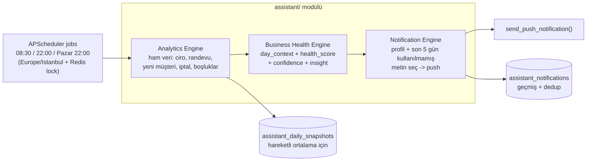

# PLANN Asistan — Zeka Motoru ve Bildirim Sistemi

## Karar Özeti
- **Kapsam:** Sadece TR işletmeleri (Europe/Istanbul, TRY, Türkçe metinler)
- **Alıcı:** Sadece işletme sahibi (`admin` rolü)
- **Metin havuzu: TESLİM ALINDI.** 360 metnin tamamı (3 profil x 12 senaryo x 10 varyasyon) kullanıcı tarafından yazıldı ve sohbette teslim edildi. Uygulamanın **ilk adımı** bu metinleri `backend/assistant/messages_tr.json` dosyasına birebir yazmaktır.
- **Kanal:** Ücretsiz Push (mevcut `send_push_notification`), tıklayınca Dashboard'a deep-link.
- **Ses Tonu (Tone of Voice):** Metinler `profile` kırılımıyla tutulur → `SINCERE_BEAUTY` (Güzellik Salonu), `SINCERE_HAIRDRESSER` (Kuaför), `PROFESSIONAL` (**diğer tüm sektörler**: Masaj/SPA, Diyetisyen, Psikolog, Diş Klinikleri, Diğer/Boş). Profil **sektörden otomatik türetilir ve kullanıcı tarafından değiştirilemez** (Ayarlar'da seçim yok). Analytics ve Health Engine profilden **bağımsızdır**; değişen tek şey Notification Engine'in DB'den çektiği metin çuvalıdır. Toplam havuz: 3 profil x 12 senaryo x 10 varyasyon = **360 metin**.

## Mimari (3 Katman)



## Yeni Modül: `backend/assistant/`
- `scenarios.py` — 12 senaryo etiketi (enum) + `AssistantProfile` enum (`SINCERE_BEAUTY`/`SINCERE_HAIRDRESSER`/`PROFESSIONAL`) + sektör→profil eşleme tablosu (`SECTOR_PROFILE_MAP`) + **`SCENARIO_PLACEHOLDER_ALIASES`** (senaryo bazlı placeholder eşlemesi, aşağıda) + JSON karar paketi şeması + gün-tipi karar ağacı sabitleri.
- `analytics_engine.py` — org+tarih için ham metrikleri hesaplar: tamamlanan ciro (`appointments.status=="Tamamlandı"` → `service_price`), randevu sayısı, yeni müşteri (telefon başına ilk randevu / `customers.created_at`), iptal/gelmedi, boomerang (180 gün sonrası dönen), doluluk % ve **aralıksız boşluk** (mevcut `/api/public/availability` slot mantığı temel alınarak `business_hours` + `users.days_off/breaks`'ten yeni hesaplanır).
- `health_engine.py` — ısınma dönemi (org yaşı <7 gün → motivasyon/dünle kıyas; ≥8 gün → hareketli ortalama, geçen haftanın aynı günü / son 4 hafta). `day_context`, `health_score`, `confidence_score`, `primary_metric`, `insight_reason` üretir. Zaman-farkındalıklı boşluk: `lead_time = gap_start - 08:30`, `<180dk → early_gap`, `>180dk → late_gap` (eşik: ≥120dk aralıksız boşluk).
- `notification_engine.py` — karar paketini okur, org'un profilini `settings.sector` → `SECTOR_PROFILE_MAP` ile **çalışma anında türetir** (DB'de ayrı alan tutulmaz), `assistant_messages` havuzundan `(scenario, lang, profile)` eşleşen ve **son 5 günde kullanılmamış** varyasyonu seçer, placeholder'ları doldurur, push atar, `assistant_notifications`'a yazar. `{hizmet_adi}` org'un kendi verisinden (o gün/hafta öne çıkan hizmet snapshot'ı) çekilir — güzellikte "Lazer Epilasyon", klinikte "İmplant Tedavisi" otomatik gelir.
- `scheduler_jobs.py` — `morning_briefing_job`, `night_closing_job`, `weekly_summary_job`. Her biri tüm TR org'larını dolaşır; **Redis dağıtık kilit** (`_acquire_lock` deseni) ile 17 worker'da tek çalışır. Pazar 22:00'de gece kapanışı yerine haftalık özet gönderilir.
- `messages_tr.json` — **kullanıcının teslim ettiği 360 metnin birebir yazılacağı dosya**: `{ "SINCERE_BEAUTY": {12 senaryo x 10}, "SINCERE_HAIRDRESSER": {12 senaryo x 10}, "PROFESSIONAL": {12 senaryo x 10} }`. Profiller bağımsız seed'lenebilir (biri boşsa fallback: `SINCERE_*` → diğer sincere, yoksa `PROFESSIONAL`). Yeni ton/sektör açılışı = yeni bir profil anahtarı + seed (≈15 dk).
- `seed_messages.py` — JSON'u `(scenario, lang, profile)` üçlüsüyle `assistant_messages` koleksiyonuna yükleyen idempotent seed script.
- `endpoints.py` — `router = APIRouter()`: bildirim geçmişi listesi + superadmin test/önizleme (bir org için karar paketini ve seçilecek metni çalıştırmadan gösterir; test push gönderir).

## Senaryolar (12 etiket)
- **Sabah (08:30):** `morning_busy` (%75+ dolu), `morning_normal` (%40-74), `morning_early_gap` (sabah boş/akşam dolu), `morning_late_gap` (öğleden sonra boşluk).
- **Gece (22:00):** `night_growth` (2+ yeni müşteri), `night_loyalty` (çoğunluk eski müşteri), `night_boomerang` (6 ay sonrası dönen), `night_revenue` (ciro MA +%20), `night_honest` (düşük/sakin).
- **Haftalık (Pazar 22:00):** `weekly_record` (MA +%15, nedenli), `weekly_normal` (stabil), `weekly_alarm` (MA -%15, nedenli).

## Karar Paketi (Health → Notification)
```json
{
  "day_context": "revenue_day",
  "health_score": 88,
  "confidence_score": 95,
  "primary_metric": "revenue_up_20_percent",
  "insight_reason": "protez_tirnak_surge",
  "sub_context": null,
  "gap_details": { "has_gap": true, "gap_start_time": "14:00", "lead_time_minutes": 330, "gap_type": "late_gap" }
}
```
> Not: Karar paketi profilden bağımsızdır. Profil yalnızca Notification Engine'de metin seçimine etki eder.

## Sektörel Ses Tonu (Tone of Voice)
- **Profil değerleri (3 ton, teslim edilen JSON anahtarlarıyla birebir):**
  - `SINCERE_BEAUTY` — samimi, kadın ağırlıklı güzellik dili ("canım", "tatlım", "kraliçe").
  - `SINCERE_HAIRDRESSER` — cinsiyetsiz ama sıcak/motive edici ("ellerine sağlık", "hadi güne başlayalım").
  - `PROFESSIONAL` — resmi/kurumsal, siz dili ("Günaydın Sayın {isim}").
  - Profil sayısı sınırsız genişletilebilir; yeni ton = yeni JSON anahtarı + map satırı, kod değişmez.
- **Nerede saklanır:** Hiçbir yerde — DB'de `assistant_profile` alanı **tutulmaz**. Profil her gönderimde mevcut `settings.sector` değerinden `SECTOR_PROFILE_MAP` ile türetilir. Bu sayede onboarding/register akışına ve `Settings` modeline dokunmak gerekmez.
- **Kullanıcı değiştiremez:** Ayarlar'da ton seçimi yoktur. Eşleme sabittir.
- **Sektör → profil eşleme (kayıttaki birebir `settings.sector` değerleri, `RegisterPage.js`):**
  - `Kuaför` → `SINCERE_HAIRDRESSER`
  - `Güzellik Salonu` → `SINCERE_BEAUTY`
  - `Masaj / SPA` → `PROFESSIONAL`
  - `Diyetisyen` → `PROFESSIONAL`
  - `Psikolog / Danışmanlık` → `PROFESSIONAL`
  - `Diş Klinikleri` → `PROFESSIONAL`
  - `Diğer/Boş` → `PROFESSIONAL`
- **Varsayılan (boş/eşleşmeyen/gelecekte eklenecek sektör):** `PROFESSIONAL`. Yani sadece iki sektör samimi ton alır, geri kalan her şey resmi tondadır.
- **Destek kaçış yolu:** Ton yanlış geldiyse (örn. erkek sahipli bir "Güzellik Salonu" samimi/kadın diline maruz kalıyorsa) çözüm, mevcut `settings.sector` değerini değiştirmektir. Ayrı bir override alanı yoktur.
- **Placeholder'lar sektöre uyum sağlar:** `{hizmet_adi}` org'un kendi verisinden geldiği için ("İmplant Tedavisi" / "Full Ekspertiz Paketi") sektör değişince otomatik doğru kelime gelir; kod değişmez.

## Placeholder Sözleşmesi (teslim edilen metinlerden çıkarıldı)
- `{isim}` — `users.full_name`'den türetilir: `SINCERE_*` → **sadece ad** (ilk kelime, "Ayşe"), `PROFESSIONAL` → **sadece soyad** (son kelime, "Sayın Yılmaz"). Tek kelimelik isimde aynı kelime kullanılır. Tüm senaryolarda.
- `{randevu_sayisi}` — Senaryoya göre anlamı değişir (aşağıdaki alias tablosu). morning_*, night_growth, night_boomerang, night_revenue.
- `{ilk_randevu_saati}` — Günün ilk randevusunun saati (`HH:MM`). morning_busy, morning_normal.
- `{ciro}` — Gece senaryolarında **günlük**, weekly senaryolarında **haftalık** ciro (TRY, binlik ayraçlı). night_*, weekly_*.
- `{hizmet_adi}` — Haftanın öne çıkan / en çok değişen hizmet adı (appointment snapshot'ından). weekly_*.
- `{oran}` — Yüzde değişim (mutlak değer, işaretsiz — metin yönü zaten belirtiyor). weekly_record, weekly_alarm.
- `{bos_baslangic}` / `{bos_bitis}` — Aralıksız boşluğun başlangıç/bitiş saati (`HH:MM`). morning_late_gap.

### Senaryo bazlı placeholder eşlemesi (`SCENARIO_PLACEHOLDER_ALIASES`) — KRİTİK
Teslim edilen metinlerde `{randevu_sayisi}` bazı senaryolarda randevu sayısı değil, **başka bir sayacı** ifade ediyor. 360 metni elle düzenlemek yerine motor senaryo bazlı eşleme yapar:
- `night_growth` → `{randevu_sayisi}` = **yeni müşteri sayısı** (örn. "Tam {randevu_sayisi} yeni müşteri...")
- `night_boomerang` → `{randevu_sayisi}` = **geri dönen (boomerang) müşteri sayısı** (örn. "{randevu_sayisi} uyuyan müşteriyi geri döndürdün")
- `morning_*`, `night_revenue` → `{randevu_sayisi}` = **günün toplam randevu sayısı** (varsayılan)

Bu eşleme olmadan mesajlar yanlış sayı basar (3 yeni müşteri varken "12 yeni müşteri" gibi).

### Metinlerde düzeltilecek iki nokta
- `PROFESSIONAL` / `night_loyalty` 5. varyasyon: "Başarırahmaların devamını dileriz." → **"Başarılarınızın devamını dileriz."**
- `PROFESSIONAL` / `weekly_record` 4. varyasyon: sabit "hedeflerimizi %15 aşarak" → **`%{oran}`** ile dinamikleştirilecek (gerçek oran farklı çıkarsa çelişmesin).

## Yeni MongoDB Koleksiyonları (indexler `lifespan()` Step 5'e)
- `assistant_messages` — metin havuzu: `{scenario, lang, profile, variation_index, text, is_active}`. Index: `(scenario, lang, profile, is_active)`.
- `assistant_notifications` — gönderim geçmişi + dedup: `{organization_id, user_id, scenario, message_id, context(JSON), sent_at}`. Index: `(organization_id, scenario, sent_at)` ve `(organization_id, sent_at)`.
- `assistant_daily_snapshots` — günlük metrik snapshot'u (hareketli ortalama/haftalık için): `{organization_id, date, revenue, appts, new_customers, ...}`. Index: `(organization_id, date)`.

## Mevcut Dosyalarda Değişiklik
- `backend/server.py`
  - `lifespan()` Step 4: `assistant.scheduler_jobs.register_assistant_jobs(scheduler, get_db)` — `CronTrigger(..., timezone=ZoneInfo("Europe/Istanbul"))` ile 08:30 / 22:00 / Pazar 22:00.
  - `lifespan()` Step 5: yeni koleksiyon indexleri.
  - ~line 15442: `app.include_router(assistant_router, tags=["Assistant"])`.
  - Feature flag: modül seviyesinde `ASSISTANT_ENABLED` (`AUDIT_LOGS_ENABLED` deseni).
  - **`Settings` modeline yeni alan eklenmez, onboarding/register akışına dokunulmaz** — profil mevcut `settings.sector`'den çalışma anında türetilir.
- **`frontend/src/components/Settings.js` değişmez** — Ayarlar'da ton seçimi yoktur.
- `frontend/src/App.js` — `pushNotificationActionPerformed` (mevcut sadece `OPEN_STORE`) içine `data.action === "OPEN_DASHBOARD"` → `setCurrentView("dashboard")` eklenir; push `data.url = "/dashboard"` web SW için zaten çalışır.
- Bildirim `data`: `{type:"assistant", action:"OPEN_DASHBOARD", scenario, notification_id, url:"/dashboard"}`.
- (Opsiyonel) `frontend/src/App.js` zil menüsü — asistan bildirimlerini `assistant_notifications` endpoint'inden çekip gösterme.

## Puanlama / Karar Mantığı (özet)
- **confidence_score:** kıyaslanabilir geçmiş gün sayısına göre; <7 gün ~55, son 4 haftanın aynı günü tamsa ~95.
- **health_score:** sabah = doluluk% ağırlıklı; gece = ciro/MA + yeni müşteri + sadakat karışımı (dinamik ağırlık).
- **day_context önceliği (gece):** boomerang > growth > revenue > loyalty > honest (ilk eşiği geçen kazanır).

## Doğrulama
- Standalone Python script ile bir demo org üzerinde her üç job'ın karar paketini ve seçilen metni yazdırma (pytest ortamı yok — proje deseni bu).
- Superadmin test endpoint'i ile gerçek push denemesi.
- Docker backend + frontend rebuild.

## Sınırlar / Notlar
- Bu iterasyon TR-only; UK için ileride `timezone` + GBP + EN metin havuzu eklenebilir (extension point olarak `lang` alanı hazır).
- **360 metnin tamamı teslim alındı** (sohbette, 3 profil x 12 senaryo x 10). Uygulamanın ilk adımı bunları `messages_tr.json`'a birebir yazmak; ardından `seed_messages.py` ile DB'ye yüklenir.
- `PROFESSIONAL` çuvalı en kritik havuz: Masaj/SPA, Diyetisyen, Psikolog, Diş Klinikleri, Diğer/Boş ve gelecekteki tüm yeni sektörler oraya düşüyor.
- `morning_early_gap` metinleri "ilk 2 saat / öğlene kadar boş" gibi yaklaşık ifadeler içeriyor; `early_gap` tanımı gereği boşluk 08:30'dan itibaren 180 dk içinde başladığı için bu ifadeler tutarlı kalır.
- Yeni sektöre/tona açılmak = yeni profil JSON'u + `seed_messages.py` çalıştırmak; Analytics/Health Engine hiç değişmez.
