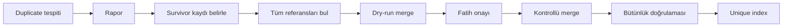

# PLANN Master Plan — Doğrulanmış Uygulama Sırası

Belgedeki her madde gerçek kodla karşılaştırıldı. Fazlar başlangıçta **düşük riskten yükseğe** dizildi; her faz ayrı onay noktasıdır. 29 Eylül 2026 analiziyle uygulama sırası aşağıdaki "Güncel durum" tablosuna göre yeniden belirlendi.

## Güncel durum ve sıradaki işler (29 Eylül 2026)

| Faz | Durum |
| --- | --- |
| 0, 1, 2, 3, 5, 12, 13 | Tamamlandı, canlıda |
| 9 | iOS 6.4 App Store'da; Android 6.4 Play'e çıkmadı |
| 4 | Kısmen: billing e-postaları canlıda; paywall / ödeme linki yok |
| 6, 7, 8, 10, 11 | Bekliyor (6: ödeme olayı nedeniyle acil) |

Canlı sürümler: backend + web `a7b48b58` (29 Eyl ~02:00), Capgo `production` = `internal` = **6.4.3**. Force-update: `latest_version` iOS 6.4 / Android 6.3, `min_supported_version` iki platformda 6.3.

**Önerilen sıra:** Faz 6a (yalnız para hareketi yapan job'lar — acil) → Capgo plan kararı → Faz 7 → Faz 4 → Android 6.4 → Faz 6b → Faz 8 → Faz 10 → Faz 11. Gerekçe:

1. **Faz 6a:** mükerrer ödeme partisi canlıda gerçekleşti (aşağıda "Olay — mükerrer ödeme partileri"). Mevcut veri düzeltildi, ama kod aynı; işletmelerin cüzdanında eşik üstü bakiye biriktiğinde mükerrer parti yeniden oluşur.
2. **Capgo:** bu dönemin bütün hotfix'leri OTA ile gitti; hesap krediyle çalışıyor. Kredi biterse her düzeltme mağaza onayı bekler.
3. **Faz 7:** rehber aktarımı artık saniyeler sürdüğü için içe aktarma hacmi artacak; `0…` (11 hane) varyant açığı ve `_apply_customer_delta`'nın birebir upsert'i hâlâ açık.
4. **Faz 4:** gelir kalemi — Faz 0'da 75 işletmenin 72'si trial, 1'i Stripe aboneli; paywall ve ödeme linki yok.
5. **Android 6.4:** Faz 9'un `atInstall` kazancı Android'de ancak 6.4 ile gelir.

## Doğrulama Notu — Belge ile Kod Arasındaki Farklar

Uygulamaya geçmeden önce kabul edilmesi gereken düzeltmeler:

- `tenant_id` alanı yok; doğru alan `organization_id`. Belgedeki index komutu bu haliyle uygulanamaz.
- Reminder distributed lock **zaten var** ([backend/server.py](backend/server.py):667) + randevu bazında Mongo atomic claim ([backend/server.py](backend/server.py):724). Kilitsiz olanlar: `recurring_payment_job`, `tuesday_batch_prepare_cron`, `run_expiry_crons`, `run_sla_monitor_cron`, DLQ retry, settlement/wise job'ları.
- `customers_org_phone_unique` index'i kodda **zaten deneniyor**, hata alırsa non-unique fallback'e düşüyor ([backend/server.py](backend/server.py):1201-1241). Prod'daki gerçek durum DB'den okunmalı.
- Randevu-müşteri bağı `customer_id` değil, denormalize `phone` + `customer_name`.
- Wizard'da debounce zaten var (150 ms); empty state ve wizard içinden hizmet oluşturma **Faz 1'de eklendi**.
- `invoice.payment_failed` production webhook'a bağlandı (26 Ağu 2026); grace mail `hosted_invoice_url` kullanıyor. `GET /api/subscription/payment-link` ve `BillingGateModal` **hâlâ yok** (Faz 4 kalanı). Stripe Customer Portal ve mobil içi paket seçimi (Faz 12) canlıda.

## Faz 0 — Read-Only Envanter (kod değişikliği yok)

Hiçbir yazma işlemi yapılmadan prod'dan rapor çıkarılır ve onaya sunulur:

- `customers` üzerinde `customers_org_phone_unique` index'i gerçekten var mı, yoksa fallback mi kurulmuş?
- `(organization_id, phone)` bazında duplicate sayısı, kaç org etkilenmiş, duplicate'lerin telefon format dağılımı.
- Aynı telefon + farklı isim varyantı sayısı (wizard/public kaynaklı duplicate'ler).
- `organization_plans` içinde `card_saved: true` olan org var mı (PayTR recurring job'un patlayıp patlamayacağını belirler).
- Geri yüklenebilirliği doğrulanmış MongoDB yedeği.

Çıktı: rapor + onay. Bu faz olmadan hiçbir DB fazına geçilmez.

## Faz 1 — Frontend UX (çok düşük risk, OTA ile gider)

1. **Wizard hizmet arama empty state** ([frontend/src/components/AppointmentFormWizard.js](frontend/src/components/AppointmentFormWizard.js):887-938): sonuç yoksa boş grid yerine "sonuç bulunamadı" + `[+ Yeni Hizmet Ekle]` + `[Aramayı Temizle]`. Yeni hizmet modalı arama metniyle ön-doldurulur, kaydedince wizard kaldığı yerden devam eder.
2. **Wizard müşteri arama empty state** ([frontend/src/components/AppointmentFormWizard.js](frontend/src/components/AppointmentFormWizard.js):1036-1064): aynı desen; girilen metin telefon formatındaysa isim yerine telefon alanına doldurulur.
3. **Müşteri listesi ilk yükleme skeleton'ı** (şu an boş liste görünüyor).

Backend'e dokunmaz. Tüm metinler i18n dosyalarına eklenir.

## Faz 2 — Katalog Toplu Atama (düşük risk, additive endpoint)

- Yeni endpoint: `POST /api/categories/{category_id}/services` — gövde `{ service_ids: [...] }`, yalnızca admin, `organization_id` filtreli, `update_many` ile `category_id` set eder. Mevcut hiçbir response şekli değişmez (contract güvenli).
- [frontend/src/components/ServiceManagement.js](frontend/src/components/ServiceManagement.js) kategori kartına "Hizmet Ata" akışı: çoklu seçim listesi ile tek seferde atama.

## Faz 3 — Appointments Compound Index (düşük risk, geri alınabilir)

Sorgu şekilleriyle uyuşmayan index'ler tespit edildi. `background` index olarak eklenecekler:

- `(organization_id, appointment_date, appointment_time, id)` — `GET /api/appointments` cursor sıralaması ([backend/server.py](backend/server.py):7643).
- `(organization_id, staff_member_id, appointment_date)` — Calendar haftalık/aylık görünüm.

Önce `explain()` çıktısı alınır, index sonrası tekrar ölçülür. Index eklemek geri alınabilir (`dropIndex`), veri değiştirmez.

## Faz 4 — Billing Durum Makinesi ve Paywall (orta risk)

**Durum (26 Ağustos 2026): kısmen tamam.** E-posta + `invoice.payment_failed` gitti; paywall UI ve makine-okunur `state` açık. Sıradaki iş bu kalan dilim.

Belgenin istediği üç durum backend'de gerçekten ayrıştırılır:

- `trial_expired` — hiç abonelik başlatılmamış, trial bitmiş.
- `past_due_grace` — ödeme başarısız, `SUBSCRIPTION_GRACE_DAYS = 3` içinde ([backend/server.py](backend/server.py):15891).
- `suspended` — grace bitmiş.

Giden (26 Ağu 2026):

- Production `handle_stripe_webhook` + merchant `_route_event` → `invoice.payment_failed` → `notify_saas_invoice_payment_failed` (grace mail; CTA = `hosted_invoice_url`).
- Scheduler (~120s): trial_ended + suspended mailleri. Epoch `BILLING_LIFECYCLE_EMAIL_EPOCH` — geçmişe gitmez.
- Copy `backend/billing_lifecycle_emails.py` (`TRIAL_ENDED_COPY` / `GRACE_COPY` / `SUSPENDED_COPY`) — Fatih onayladı, kalsın.
- Flag'ler: `trial_ended_email_sent` / `grace_email_sent` / `suspended_email_sent`. Stripe `event.id` `webhook_events` ile.

Kalan adımlar:

1. `GET /api/subscription/payment-link` — açık faturanın `hosted_invoice_url`'ini döndürür; yoksa Customer Portal'a düşer.
2. `check_quota_and_increment` çıktısını durum koduyla zenginleştir; 403 gövdesine makine-okunur `state` alanı **ekle** (mevcut `detail` string'i aynen korunur — sahadaki donmuş mobil build'ler bozulmaz).
3. Frontend: tek bir `BillingGateModal` bileşeni, duruma göre metin/CTA değişir. Dashboard bildirimi için mevcut soft banner tasarımı yeniden kullanılır ([frontend/src/components/ForceUpdateModal.js](frontend/src/components/ForceUpdateModal.js):66-99).
4. Draft state: paywall açıldığında wizard formu saklanır, ödeme sonrası kaldığı yerden devam eder.
5. Ödeme sonrası state tazeleme: webhook + uygulama foreground'a gelince refresh + kritik aksiyon öncesi backend doğrulaması.

## Faz 5 — Login Intercept (tamamlandı, canlıda — 28 Ağustos 2026)

**Karar (Fatih onayı):** belgedeki iki adımlı `check-email` akışı **uygulanmadı**. Yerine şifre denemesi sonrası yönlendirme seçildi — aynı UX faydası, yeni enumeration kanalı açmadan. Ayrıntı: aşağıda "Faz 5 — uygulama notları".

## Faz 6 — Zamanlanmış Görev Kilitleri (yüksek risk — ÖNCELİK 1, 29 Eylül 2026)

### Olay — mükerrer ödeme partileri (tespit ve veri düzeltmesi 29 Eylül 2026)

**Kök neden:** APScheduler her uvicorn worker'ında ayrı başlatılıyor (logda `Step 4 SUCCESS` ×17). `max_instances=1` yalnız süreç içinde geçerli, worker'lar arası koruma değil. `financial/cron_jobs.py`'deki `_acquire_lock` yalnız 4 job'da kullanılıyor (`currency_shield`, `daily_reconciliation`, `wise_auto_convert`, `refund_reconciliation`) ve Redis hatasında `True` döndürüyor (fail-open). Kilitsiz, 17 kez eşzamanlı çalışabilen job'lar: `v2_tuesday_batch_prepare` (`tuesday_batch_prepare_cron`), `settlement_check_job`, `refund_reserve_release_job`, `wise_status_check_job`, `quote_cleanup_job`, `failed_webhook_retry_job`, `v2_expiry_crons`, `v2_refund_sla_monitor`, `v2_dlq_retry`.

**Veride iz** (tek etkilenen işletme: Royal Premium Care, `bd215db0…`):

| Tarih | Parti | Durum | Not |
| --- | --- | --- | --- |
| 4 Ağu 23:00 | 3 (aynı `idempotency_key`) | `partial_failure` | Her biri tek işlem içeriyor ama `total_amount_minor` = 1.116.350 (cüzdanın tamamı). 14 Ağu'da üçü de fonlanmış, 3 ayrı Wise transferi: `2311141975`, `2311141995`, `2311142011`. Hata: `Invalid transition: 'available' → 'paid_out'` |
| 18 Ağu 23:00 | 3 (aynı anahtar) | `awaiting_admin_fund` | Aynı 3 işlem, parti başına bir tane; her parti yine 1.116.350 |
| 1 Eyl 23:00 | 1 | `awaiting_admin_fund` | Üç işlem tek partide, 1.116.350 |
| 15 Eyl 23:00 | 2 (aynı anahtar) | `awaiting_admin_fund` | 1 + 2 işlem; iki parti de 1.116.350 |

Parti tutarı içeriğinden bağımsız olarak her seferinde cüzdanın tamamı. Sebep: 17 worker aynı anda üç işlemi toplayıp `total_in_batch`'i hesaplıyor, sonra işlemleri `reserved_for_batch`'e çekmek için yarışıyor; her worker tek işlemi kazanıyor ama partiye tüm toplamı yazıyor. Bekleyen 6 partinin toplamı ₺66.981; gerçek alacak ₺11.163,50.

**`Invalid transition: 'available' → 'paid_out'` sebebi:** 4 Ağu'da `reserved_for_batch`'e alınan işlemler 7 günlük rezerv süresi dolunca 11 Ağu'da `reserve_expiry_rollback` ile `available`'a geri döndü; fonlama 14 Ağu'da yapıldığında işlemler artık rezervde değildi. Aynı döngü her iki haftada bir tekrarlandı (4 Ağu, 18 Ağu, 1 Eyl, 15 Eyl — sıradaki çalışma 29 Eyl 23:00 UTC olacaktı).

İşlemler: `0120335f` ₺5.863,50, `31f57ad2` ₺5.000, `ef05d257` ₺300 = ₺11.163,50 (GBP havuzunda 18.517 pence). Cüzdandaki `total_paid_out_minor` 1.200.000 = Nisan'da başarıyla fonlanan 2 × ₺6.000'lik parti (`aaef080f`, `6248e978`).

**Veri düzeltmesi (29 Eyl 2026 ~02:15, Fatih'in talimatıyla):** Royal Premium Care Fatih'in kendi işletmesi; ₺11.163,50 Wise'tan doğrudan kendisine gönderildi, gerçek bakiye 0.

| Kayıt | Önce | Sonra |
| --- | --- | --- |
| 3 işlem | `available` | `paid_out` (`state_history`'e `manual_payout_correction`, `paid_out_at`) |
| Cüzdan `available_balance_minor` | 1.116.350 | 0 |
| Cüzdan `total_paid_out_minor` | 1.200.000 | 2.316.350 |
| Cüzdan `pool_balance_gbp_minor` | 18.517 | 0 |
| `awaiting_admin_fund` partileri | 6 (`847f202c`, `22b705a7`, `a3717925`, `679b03f9`, `f7a437e2`, `404c3db8`) | silindi |
| 4 Ağu `partial_failure` partileri (Wise transfer no'lu) | 3 | dokunulmadı — geçmiş kaydı |

Cüzdan değişikliği state machine'in `→ paid_out` kuralıyla aynı alanları etkiler. Tüm yazmalar beklenen mevcut duruma koşullu yapıldı. `financial_audit_log`'a `manual_payout_correction` kaydı düşüldü. Yedek: `/root/backups/financial/royal_payout_fix_20260929_before.json` (cüzdan + 3 işlem + 9 parti). Sonrası: `available` işlem 0, sistem genelinde `awaiting_admin_fund` parti 0 → bu geceki çalışma parti üretmez. Başka işletmeye dokunulmadı.

### Faz 6a — para hareketi yapan job'lar (acil)

1. Ortak `with_distributed_lock` yardımcısı: ownership token + TTL + Lua compare-and-delete ile güvenli release. Para hareketi yapan job'larda Redis erişilemezse **fail-closed** (job atlanır, loglanır).
2. Kilit: `tuesday_batch_prepare_cron`, `settlement_check_job`, `refund_reserve_release_job`, `wise_status_check_job`, `failed_webhook_retry_job`, `v2_dlq_retry`.
3. `payout_batches.idempotency_key` üzerine unique index ve parti oluşturmada duplicate-key'i yakalayan idempotent yazım. Kalan 3 `partial_failure` parti aynı anahtarı paylaşıyor; index ya `partialFilterExpression` ile yeni partilere uygulanır ya da bu 3 kaydın anahtarı sonek alır.
4. Parti tutarı, yalnızca başarıyla rezerve edilen (`reserved_ok`) işlemlerin toplamından hesaplanır.
5. Rezerv süresi ile fonlama arasındaki çakışma: süresi dolmuş partinin fonlanması engellenmeli (parti `expired`'a çekilir, panelde gösterilmez) ya da süre dolmadan önce fonlama yapılmadıysa parti de işlemlerle birlikte iptal edilmeli. Bugün süre dolunca işlemler geri dönüyor ama parti `awaiting_admin_fund`'da kalıyor.
6. Test: iki eşzamanlı çağrıda tek parti, Redis yokken job'un atlanması, tutar = item toplamı, reddedilen geçişte tekrar partileme olmaması.

### Faz 6b — kalan job'lar ve temizlik

1. **Ölü PayTR kodunun temizliği:** `check_and_process_recurring_payments` içindeki tanımsız `PAYTR_*` sabitlerine giden yol kaldırılır veya job güvenli şekilde devre dışı bırakılır ([backend/server.py](backend/server.py):795-969). Faz 0'da `card_saved: true` org bulunursa önce bu ele alınır.
2. Ortak bir `with_distributed_lock` yardımcı fonksiyonu: ownership token + TTL + Lua compare-and-delete ile güvenli release.
3. Kilitsiz job'lara uygulanır: `tuesday_batch_prepare_cron`, `run_expiry_crons`, `run_sla_monitor_cron`, DLQ retry, settlement ve Wise job'ları.
4. **Fail-open kararı:** Redis erişilemezse şu an job'lar 17 worker'da birden çalışıyor. Para veya mesaj gönderen job'lar için fail-closed'a çevrilmesi ayrıca onaya sunulur.
5. Test: TTL dolması, worker restart, crash sonrası release, overlapping execution.

## Faz 7 — Telefon Normalizasyonu (yüksek risk)

- Tek bir canonical `normalize_phone()` yardımcı fonksiyonu (E.164, TR ve UK).
- **Yalnızca yeni yazma yollarında** devreye alınır: `POST /api/customers`, `POST /api/appointments`, public booking, bulk-session, AI aracı, `_apply_customer_delta`.
- Geriye dönük veri dönüşümü bu fazda **yapılmaz**; Faz 8'in parçasıdır.
- Wizard/public'teki "aynı telefon + farklı isim = yeni müşteri" davranışı gözden geçirilir: eşleşme telefona dayanır, isim farkı kayıt açmaz (isteğe bağlı olarak mevcut isim güncellenir).

## Faz 8 — Duplicate Merge ve Unique Index (en yüksek risk)

Belgedeki zorunlu sıra aynen uygulanır, otomatik silme yoktur:



Referans güncellenecek alanlar (denormalize telefon/isim taşıyanlar): `appointments`, `customer_notes`, `transactions`, `merchant_transactions`, `session_credits`, `stripe_customers`, `marketing_autopilot` görevleri, `refund_reconciliation_pending`. Sayaç alanları (`total_appointments`, `completed_appointments`, `first/last_appointment_at`) merge sonrası yeniden hesaplanır.

Walk-in/paylaşılan telefon senaryosu (`phone: "0"`) unique index'i engelleyebilir; index kurulmadan önce bu kayıtlar için ayrı strateji kararlaştırılır.

## Faz 9 — Capgo OTA Kontrolü (iOS 6.4 App Store'da — 28 Ağustos 2026; Android 6.4 bekliyor)

Özgün tasarım (`autoUpdate: false` + elle `download`/`set` + yüzdeli ekran) **uygulanmadı**: plugin API'si o günden beri değişti ve aynı sonucu çok daha az riskle veren bir yol açıldı. Ayrıntı: aşağıda "Faz 9 — uygulama notları".

- Ön koşul **doğrulandı**: `cap sync ios` Podfile'a `CapgoCapacitorUpdater` pod'unu ekliyor (git'teki Podfile eskiydi, üretim CI'da yeniden yazılıyor).
- Bu değişiklik OTA ile gönderilemez; mağaza sürümü gerektirir ve mevcut kullanıcılar mağazadan güncellemeden yeni akışa geçmez.

## Faz 10 — Auth v2 (çok yüksek risk, ayrı program — Google adımından itibaren native build gerektirir)

Sıra: identity soyutlaması → mevcut e-posta kullanıcılarının lazy migration'ı → Google → Apple → secure credential/Face ID → provider-aware fallback. Her adım ayrı feature flag arkasında, eski `email + password` login'i hiç kapatılmadan. Detaylı migration kuralları belgede zaten tanımlı ve kodla uyumlu bulundu (tek `users` collection, `username` birincil kimlik, bcrypt hash korunur).

**Teslim kanalı — ikiye ayrılıyor.** İlk iki adım (identity soyutlaması + lazy migration) saf backend; mağaza beklemeden ilerler. Üçüncü adımdan (Google) itibaren iş native'e geçiyor: Google Sign-In, Apple Sign-In ve Face ID / secure credential üçü de Capacitor native plugin'i, iOS'ta entitlement ve `Info.plist` girdisi istiyor. Bunlar **OTA ile gönderilemez** — Faz 9 gibi mağaza sürümü gerektirir. Planlama yapılırken bu üç adımın tek bir native release'te toplanması, her biri için ayrı mağaza turu beklememek adına mantıklı.

## Faz 11 — Apple Ads Entegrasyonu (ayrı program)

Mevcut `currency_shield` deseni (zamanlanmış sync + koleksiyon + on-demand tazeleme) bu iş için hazır bir şablon. Credential'lar `backend/.env` üzerinden, frontend'e hiç verilmeden. Gerçek API response şekli doğrulanmadan alan adı veya idempotency anahtarı varsayılmaz.

## Faz 12 — Mobil içi paket seçimi + Stripe Checkout (In-App Browser)

**Tamamlandı (26 Ağustos 2026).** Faz 3'ten bağımsızdı; Faz 4'ten önce alındı. Native'de paket seçimi uygulama içinde; kart Stripe Checkout'ta `@capacitor/browser` (SFSafariViewController / Chrome Custom Tabs). IAP / StoreKit yok. Detay: aşağıda "Faz 12 — uygulama notları".

## Faz 13 — Canlı Bug Hotfix: Logo, Bildirim, Tarih Seçici (düşük–orta risk — Fatih bildirimi 28 Eylül 2026)

Risk sırasından bağımsız: canlıda görülen ürün bug'ları. Faz 9 mağaza yayını bittikten hemen sonra veya onunla paralel alınabilir; native build **gerekmez** (OTA yeterli). Faz 4'ten önce alınması mantıklı — müşteri ilk izlenimini ve destek kanalını bozuyor.

### 13.1 Online randevu → Bildirimler listesinde yok

**Belirti:** Public booking (`/public/appointments`) ile gelen randevularda push / Socket.IO olayları gidebiliyor olabilir; işletme panelindeki **Bildirimler** bölümünde kayıt görünmüyor.

**İnceleme yolu (kod yazmadan önce):**

1. `POST /public/appointments` → `send_notifications_background` / `emit_to_organization` ([backend/server.py](backend/server.py) ~15371–15494) hangi event'i yayınlıyor (`new_appointment` vs panelin dinlediği event adı).
2. Frontend `App.js` bildirim state'i: hangi socket event'leri `setNotifications`'a yazılıyor; online/public kaynaklı event orada mı.
3. Bildirimlerin kalıcı koleksiyona yazılıp yazılmadığı (sayfa yenilenince kaybolma vs hiç oluşmama).
4. Push giden ama in-app liste boş mu, yoksa ikisi de mi yok — ayrıştır.

**Çıktı:** online randevu, panelden oluşturulan randevuyla aynı şekilde Bildirimler listesinde görünür (okundu/okunmadı + badge).

### 13.2 Logo yükleme — `[object Object]` hatası

**Belirti:** İşletme sahibi Ayarlar / Profil (veya Online Booking) üzerinden logo yüklerken toast: `Logo yüklenemedi: [object Object]` (i18n `settings.profile.logoUploadError`).

**Muhtemel kök:** FastAPI `HTTPException.detail` bazen **string değil dizi/obje** (validation error listesi); frontend `error.response?.data?.detail` doğrudan string interpolasyonuna gidiyor ([SettingsProfile.js](frontend/src/components/SettingsProfile.js) ~219, ~242; [SettingsOnlineBooking.js](frontend/src/components/SettingsOnlineBooking.js) benzer). Sonuç: `[object Object]`.

**İnceleme + düzeltme:**

1. `POST /api/settings/logo` gerçek hata gövdesini yakala (network / log) — yetki, MIME, boyut, path yazma mı.
2. Frontend'de `detail` için güvenli stringify (string | array | object → okunabilir mesaj); aynı helper galeri upload'da da kullanılsın.
3. Asıl upload hatasını düzelt (kök sebep neyse: auth, disk, content-type interceptor, nginx body size).
4. Başarılı yüklemede `logo_url`'in settings'e yazılıp UI preview'ın güncellendiğini doğrula.

### 13.3 Chatwoot canlı destekte logo görünmüyor

**Belirti:** Canlı destek widget'ında işletme / kullanıcı avatarı boş veya PLANN varsayılanı; işletme logosu gelmiyor.

**İnceleme yolu:**

1. `setChatwootUser` `avatar_url` kabul ediyor ([frontend/src/lib/chatwoot.js](frontend/src/lib/chatwoot.js)); `App.js` çağrısında org `logo_url` geçilmiyor olabilir.
2. Chatwoot absolute HTTPS URL ister — relative `/api/static/logos/...` reddedilir; `getFullLogoUrl` / `BACKEND_URL` ile mutlak URL zorunlu.
3. CORS / hotlink: Chatwoot CDN'den `plannapp.co` static'e erişebiliyor mu.
4. Inbox ayarı vs contact avatar ayrımı — hangisinin boş olduğu netleştirilsin.

### 13.4 Logo zinciri genel denetim

Aynı `logo_url` alanı birden fazla yüzeyde kullanılıyor; birinin kırık olması diğerini de bozar:

| Yüzey | Beklenen davranış |
| --- | --- |
| Ayarlar profil / online booking upload | Yükle → kaydet → preview |
| Public booking sayfası header | `business.logo_url` görünür |
| Merchant panel header / sidebar | Org logosu |
| Chatwoot contact avatar | Mutlak URL |
| E-posta / ödeme şablonları | Varsa absolute URL |

Kontrol listesi: relative vs absolute URL, `BACKEND_URL` / CDN, nginx `/api/static/` proxy, dosya diskte var mı, eski kayıtlar broken path mi.

### 13.5 Randevu tarih seçici — ay başlığı kaydırınca güncellenmiyor

**Belirti:** Randevu oluşturma sihirbazında (Adım 3) yatay tarih şeridinde ayın sonuna gelince sonraki ayın günleri görünür; ama üstteki ay başlığı (`MMMM yyyy`) hâlâ eski ayı gösterir. Sonraki ayın bir gününe **tıklayınca** başlık güncellenir. Beklenen: kaydırdıkça (tıklamadan) görünür aya göre başlık otomatik değişsin.

**Kök (kod okuması):** [AppointmentFormWizard.js](frontend/src/components/AppointmentFormWizard.js) ~1498 — başlık yalnızca `formData.appointment_date`'e bağlı:

```js
format(formData.appointment_date, "MMMM yyyy", { locale: dateLocale })
```

Şerit `overflow-x-auto` ile kaydırılıyor; `scroll` event'inde ay state'i güncellenmiyor. Gün tıklanınca `setFormData(... appointment_date: date ...)` olduğu için başlık o an değişiyor — yanlışlıkla "tıklayınca sonraki ay açılıyor" gibi hissediliyor.

**Düzeltme yönü:**

1. `dateScrollerRef` üzerinde `scroll` (veya IntersectionObserver) ile viewport'ta ortadaki / baskın günün ayını hesapla.
2. Ayrı bir `visibleMonth` state'i ile başlığı buna bağla; seçili gün (`appointment_date`) değişmeden ay etiketi güncellenir.
3. Ay değişiminde kısa bir geçiş (opsiyonel); iOS smooth-scroll ile çakışmasın (mevcut `scrollDatesBy` yorumuna uy).
4. Public booking tarih seçicisinde aynı desen varsa oraya da uygula.

### 13.6 Personel ekleme — e-posta / kullanıcı adı karışıklığı

**Belirti:** Adminler "Yeni Personel Ekle" modalında e-posta alanına kullanıcı adı yazmaya çalışıyor; davet maili gitmiyor / ekleme başarısız.

**Kök:** Modal etiket olarak profil sayfasının anahtarını paylaşıyor: `t('settings.profile.fields.email')` → TR **"E-posta (Kullanıcı Adı)"** / EN **"Email (Username)"** ([StaffManagement.js](frontend/src/components/StaffManagement.js) ~500). Placeholder hardcoded `ahmet@isletme.com` — işletme domain'i gibi görünüyor, kullanıcı adı çağrışımı güçleniyor.

**Düzeltme:**

1. Personel modalına **ayrı** i18n anahtarı (`staff.fields.email` vb.) — profil sayfasındaki "E-posta (Kullanıcı Adı)" metnine dokunma (login hâlâ username=email; profil bağlamı farklı).
2. TR: **"E-posta *"** veya **"E-posta (zorunlu)"**; EN: **"Email *"** / **"Email (required)"**. "(Kullanıcı Adı)" ifadesi kaldırılır.
3. Placeholder: `ahmet@gmail.com` (hardcode yerine i18n `staff.fields.emailPlaceholder` tercih edilir; EN: `ahmet@gmail.com`).
4. Mevcut `staff.management.inviteEmailNote` metni korunur veya "davet bu adrese gider" vurgusu güçlendirilir.
5. İsteğe bağlı: client-side basit e-posta format kontrolü + net hata mesajı (kullanıcı adı formatı reddedilsin).

### 13.7 Rehberden "Tümünü Aktar" — uzun sürme uyarısı

**Belirti:** Rehberden müşterilerin tümünü aktarmak çok uzun sürüyor. Kullanıcı işlemin bittiğini sanıp sayfadan çıkıyor / uygulamayı kapatıyor; aktarım yarıda kalabiliyor. Dialog metni şu an yanıltıcı: TR `importAllDesc` = **"Rehberdeki tüm kişileri tek seferde ekler. Hızlı ve pratik."** ([translation.json](frontend/src/i18n/locales/tr/translation.json)).

**Minimum (bu fazda):** performans optimizasyonu değil — bilgilendirme.

1. `importDialog.importAllDesc` (TR/EN) metnini güncelle: işlemin rehber büyüklüğüne göre **birkaç dakika** sürebileceği; aktarım bitene kadar **sayfadan ayrılmamaları / uygulamayı kapatmamaları** gerektiği.
2. Aktarım sırasında (`importingContacts === true`) buton metninin ötesinde görünür bir bilgi satırı / banner: "Aktarım devam ediyor, lütfen bekleyin ve bu sayfada kalın" (+ mevcut spinner).
3. İsteğe bağlı: dialog'da "Tümünü Aktar" seçilince onay öncesi kısa uyarı; veya `beforeunload` / Capacitor `appStateChange` ile ayrılma riskinde toast (mobil WebView'da `beforeunload` zayıf — öncelik görünür metin).

**Sonraki (ayrı iş, bu madde değil):** toplu `POST` batch, progress sayacı (`N / M`), arka plan kuyruğu — performans iyileştirmesi Faz 13 kapsamı dışı. *(Güncelleme 29 Eyl: sayaç 13.7'de, toplu `POST` 13.10'da yapıldı; arka plan kuyruğuna gerek kalmadı.)*

### 13.8 Modal açıkken toast arkada kalıyor

**Belirti:** "Yeni Personel Ekle" modalında bir alan boş bırakılınca doğrulama toast'ı (`staff.management.fillAllFields` vb., [StaffManagement.js](frontend/src/components/StaffManagement.js) ~320–341) modalın **arkasında** çıkıyor; kullanıcı uyarıyı görmüyor, butonun çalışmadığını sanıyor. Aynı sorun Faz 1'de hizmet sihirbazında da yaşanmış ve orada toast yerine alan bazlı hatayla geçici olarak çözülmüştü (bkz. Faz 1 düzeltmesi, "Uyarılar modalın içine alındı").

**Muhtemel kök (kod okuması):**

- [ui/dialog.jsx](frontend/src/components/ui/dialog.jsx): `DialogOverlay` ve `DialogContent` `z-[1100]`, Radix Portal ile doğrudan `body` altına render ediliyor.
- [App.js](frontend/src/App.js) ~2007: `<Toaster style={{ zIndex: 9999 }} />` App ağacının **içinde** duruyor. Sayısal olarak 9999 > 1100, ama Toaster'ın bir üst elemanı kendi stacking context'ini açıyorsa (transform, `z-index`'li kapsayıcı, `isolate`, `backdrop-filter` vb.) toast o bağlamın içinde hapsolur ve body seviyesindeki dialog'un altında kalır.
- Radix modal dialog açıkken dışarıdaki her şeye `pointer-events: none` uyguluyor; toast görünse bile tıklanamaz (kapatma / action butonu).

**Düzeltme yönü:**

1. Kök nedeni tarayıcıda doğrula (DevTools'ta Toaster'ın stacking context zinciri).
2. Toaster'ı stacking context dışına çıkar: body'ye portal et veya App kökünde en dışa taşı; z-index'i dialog / sheet / drawer / alert-dialog katmanlarının (`z-[1100]`) ve alt navigasyonun (`z-1000`) üstüne sabitle. Chatwoot widget'ının (`2147483600`) altında kalması kabul edilebilir.
3. Toast'a `pointer-events: auto` ver, modal açıkken de kapatılabilsin.
4. Ayrı `<Toaster>` instance'ları olan sayfalar da aynı kurala uysun: [PublicBookingPage.js](frontend/src/components/PublicBookingPage.js) (5 adet), [RegisterPage.js](frontend/src/components/RegisterPage.js).

**Smoke listesi (tüm modallarda kontrol):** personel ekleme/düzenleme, müşteri ekleme/düzenleme/silme, rehberden aktar dialog'u, hizmet yönetimi, randevu sihirbazı (`fixed z-50` kendi overlay'i), Dashboard ve SetupWizard'daki elle yazılmış `fixed inset-0 z-50` modallar, PaymentRequestDrawer, RefundRequestModal, MerchantPaymentSettings T&C modalı, superadmin drawer'ları. Her birinde boş alanla kaydet → toast modalın **üstünde** ve okunur olmalı.

**Onay kapısı:** Fatih — (a) online randevu → Bildirimler'de görünür, (b) logo yükleme başarılı + toast temiz, (c) Chatwoot'ta logo görünür, (d) public booking header'da logo bozulmamış, (e) tarih şeridini kaydırınca ay başlığı tıklamadan güncellenir, (f) personel eklemede etiket yalnızca e-posta + zorunlu, placeholder `ahmet@gmail.com`, (g) "Tümünü Aktar" metni uzun süre + sayfada kal uyarısı içerir; aktarım sırasında da görünür, (h) modal açıkken doğrulama toast'ı modalın üstünde görünür ve kapatılabilir.

### Faz 13 — uygulama notları (29 Eylül 2026 — backend + web + OTA 6.4.3 canlıda)

Doğrulanan kök nedenler ve yapılanlar:

| Madde | Gerçek kök neden | Değişiklik |
| --- | --- | --- |
| 13.1 | Online randevular 4 farklı `source` ile kaydediliyor (`public_booking`, `_code_verified`, `_verified`, `_wa_verified`); panel yalnız tam `public_booking` eşleşmesine bakıyordu. 15 Ağustos'tan beri gelen 20 online randevunun 10'u `_code_verified`. Ayrıca yalnız `Bekliyor` gösterildiği için randevu tamamlanınca bildirim kayboluyordu. | `App.js`: `isOnlineBooking()` önek eşleşmesi (ilk yükleme + socket); durum filtresi yalnız iptal ve ödemesi tamamlanmamışları eler. Backend istatistikteki online/manuel ayrımı da önek eşleşmesine çevrildi (dönen değerler aynı: `public_booking` / `manual`). |
| 13.2 | Nginx loglarında iPhone Safari'den 4 adet `POST /api/settings/logo → 422`, gövde 140 bayt = multipart'ta `file` parçası **hiç yok** (FastAPI'de birebir yeniden üretildi). 422 `detail` dizisi toast'a string diye basılınca `[object Object]`. | Yeni `lib/imageUpload.js`: dosya yüklemeden önce belleğe okunur, canvas ile küçültülür (logo 1024 px, galeri 1600 px), dosya adıyla Blob olarak gönderilir; okunamazsa net mesaj. Hata metni `formatApiError` ile. Backend: `file` opsiyonel → eksikse okunur 400; uzantı içerik tipinden (JPG/PNG/WEBP/GIF) türetiliyor, PIL doğrulaması. **SVG artık reddediliyor** (static altından script taşıyabilirdi; diskte 1 eski SVG logo duruyor, dokunulmadı). |
| 13.3 | `setUser` çağrısında `avatar_url` hiç gönderilmiyordu. | `avatar_url` = logonun mutlak https adresi. |
| 13.4 | Depolama sağlam: `backend_static` kalıcı volume, 7 logo kaydının 7'si diskte, public URL 200. Public booking sayfası logoyu göreli yolla basıyordu (native'de kırılır). | `getLogoUrl` mutlak adrese çevirir. |
| 13.5 | Başlık yalnız seçili güne bağlıydı. | Scroll'u izleyen `visibleMonthKey`: seçili gün ekrandaysa onun ayı, değilse görünen günlerin çoğunluğunun ayı. **Ek (Fatih testi, 29 Eyl):** şerit sabit 60 gündü (Kasım sonunda bitiyordu, uzaması için son güne tıklamak gerekiyordu). Artık sona bir ekran kala 60'ar gün eklenir (üst sınır 730 gün); uzayınca seçili güne geri zıplamaz. OTA internal 6.4.2. |
| 13.6 | Modal, profil sayfasının "E-posta (Kullanıcı Adı)" anahtarını paylaşıyordu. | `staff.fields.emailRequired` / `emailPlaceholder` (`ahmet@gmail.com`); profil metnine dokunulmadı. |
| 13.7 | Kişiler tek tek `POST` ediliyor. | Açıklama metni güncellendi; aktarım sırasında `N / M` sayaçlı, ilerleme çubuklu "sayfadan ayrılmayın" kutusu. Hız iyileştirmesi ilk turda yapılmadı; **13.10'da toplu uç noktayla çözüldü**. |
| 13.8 | `#app-wrapper` `position: fixed` → kendi stacking context'i; içindeki Toaster z-index'ten bağımsız olarak body'deki Radix modallarının (`z-[1100]`) altında kalıyordu. | `ui/sonner.jsx` Toaster'ı body'ye portal eder, z 2000 + `pointer-events: auto`. Toast'a dokunmak modalı kapatmasın diye Dialog/Sheet/Drawer'a `keepOpenOnToastInteract`. Elle yazılmış `fixed z-50` modallar #app-wrapper içinde olduğu için otomatik düzeldi. PublicBooking/Register'daki ayrı Toaster'lar fixed kapsayıcıda değil, dokunulmadı. |

Doğrulama: `py_compile` OK, `tests/integration/` 22/22, logo endpoint hata yolları (dosya yok / SVG / sahte PNG / boş dosya) okunur 400 dönüyor, `npm run build` temiz.

**13.9 "Randevular yüklenemedi" toast'ı 4–5 kez, detaysız (eklendi 29 Eyl 2026):** İnternet yavaş/kapalıyken App.js açılış yüklemesi + Calendar'ın kendi yüklemesi + dönüşte art arda gelen `focus` ve `visibilitychange` her biri ayrı toast atıyordu. Yeni [lib/loadError.js](frontend/src/lib/loadError.js) `showLoadError`: bağlantı yok / zaman aşımı (20 sn) / sunucu hatası ayrımıyla `errors.loadFailed.*` metni ("Randevular yüklenemedi. Lütfen internet bağlantınızı kontrol edin."), sonner `id` ile tek kopya (bağlantı hataları tüm konular için ortak id). focus+visibility 2 sn içinde tek yenilemeye indirildi; `online` event'inde toast kapanır ve veriler yeniden yüklenir. App (randevular, hizmetler), Calendar, StaffManagement, Finance bu helper'a geçti. Test için demo hesap: `demo.test@plannapp.co` (Plann Demo Kuaför, 5 örnek randevu, `reminder_sent: true`). OTA: internal **6.3.13** (Faz 13 + 13.9) — iPhone native 6.4 olduğu için teslim edilmedi, aynı içerik **6.4.1** olarak yeniden yüklendi.

**13.10 Rehberden toplu aktarım hızlandırma (29 Eyl 2026):** Kişi başına ayrı `POST /customers` (≈4 kişi/sn; Fatih'in 813 kişilik aktarımı 14 dk) + her kişide `customer_added` socket'i → açık ekranlarda liste yenileme fırtınası. Yeni additive `POST /api/customers/bulk` (≤500/istek, rate limit 60/dk): tekrar kuralı tekli uç noktayla ortak `_customer_phone_variants`, randevu+müşteri kontrolü tek `distinct` sorgusu, `insert_many`, müşteri başına audit (flag açıksa), tek socket olayı. İstemci 200'lük gruplar gönderir; 404/405'te eski tek tek yola düşer. Canlı ölçüm: 1.000 kişi 0,14 sn. Testler: `tests/integration/test_customers_bulk.py` (8 test), toplam 30/30. Backend canlıda (Faz 13 backend dahil); OTA **6.4.3** internal'da Fatih doğruladı (813 kişi saniyeler içinde), prod'a açılmadan önce kontrol: deploy sonrası müşteri yazılan tek işletme demo, başka işletmeye taşan kayıt 0, `organization_id`'siz kayıt 0 → 6.4.3 PROD'da. Test sırasında demo hesaba eklenen 813 müşteri silindi.

**13.11 İkinci yönetici "Bilinmiyor" görünüyor (Gözde Nails, 29 Eyl 2026 — PostHog):** İşletmeye yönetici olarak eklenen Gizem'in 6 randevusu takvimde personel adı "Bilinmiyor". Veri doğru (`staff_member_id` = Gizem'in kullanıcı adı). Kök neden: `Calendar.js` ve `Dashboard.js` personel listesini `role === 'staff'` + `find(role === 'admin')` ile kuruyordu → yalnız **ilk** yönetici ekleniyordu; `AppointmentDetail.js` yöneticileri hiç almıyordu. Sihirbaz tüm yöneticileri listelediği için Gizem seçilebiliyordu. Düzeltme: üç yerde tüm yöneticiler (`admin_provides_service` açıkken). İstatistik ekranı zaten `admin`+`staff` çekiyor; Gizem'in randevuları ileri tarihli "Bekliyor" olduğu için personel sekmesinde henüz yok (yalnız tamamlananlar sayılır) — hata değil. Aynı durumdaki diğer işletmeler de düzelir. OTA internal **6.4.5**; web deploy Fatih onayından sonra.

**13.12 İstatistik: Toplam Randevu ve Silinen (29 Eyl 2026):** (a) "Toplam Randevu" aralıktaki tüm randevuları sayıyor (ileri tarihli "Bekliyor" dahil) — Gözde Nails Eylül: 88 = 85 tamamlanan + 3 bekleyen; kullanıcı tamamlananla fark görünce yanlış sandı. Fatih kararı: toplam aynı kalır, ayrı **Bekleyen** kartı eklendi. (b) "Silinen" kartı aslında `Gelmedi` sayısını gösteriyordu; randevular hard-delete edildiği ve audit log prod'da kapalı olduğu için gerçek silme hiç kaydedilmiyordu. Yeni `appointment_deletions` koleksiyonu (index `organization_id + deleted_date`): tekli silme, seans paketi silme ve müşteri silme (randevuları da siler) yolları `_record_appointment_deletions` ile yazar (flag'den bağımsız, hata silmeyi bozmaz). `/api/stats/analytics` `summary`'ye additive `pending_appointments` + `deleted_appointments` (silinme günü İstanbul tarihiyle aralıkta). Frontend 5 kart: Toplam (mobilde tam genişlik), Tamamlanan, Bekleyen, İptal, Silinen; Gelmedi kartı yok (Fatih kararı). **Geçmiş silmeler kurtarılamaz** — sayaç 29 Eyl'den itibaren doluyor. **Düzeltme (Fatih testi: Bekleyen 0):** "Bu hafta/ay/yıl" aralığı bugünde bitiyordu → ileri tarihli randevular hiç sayılmıyordu; asıl şikâyet de buydu (Toplam = Tamamlanan = 85). Artık randevu sayıları (`total_appointments`, `pending_appointments`, `by_status`, iptal/gelmedi oranı) dönemin sonuna kadar; gelir, grafik, müşteri, personel, hizmet bugüne kadar. `range.end` aynı (bugün). Gözde Nails canlı: Bu Ay 88 / 85 / 3, Bu Hafta 22 / 6 / 16, gelir değişmedi.

**Prod (29 Eyl ~23:40, Fatih talimatı):** web deploy (`main.bc5e2fe9.js`, iki alan adı 200) + Capgo `production` = **6.4.6** (iOS ve Android güncelleme sorgusu 6.4.6 dönüyor). 13.11 + 13.12 + abonelik şalteri **açık** olarak prod'da.

**13.13 İstatistik: Tüm Zamanlar + Geçen Yıl (29 Eyl 2026):** `/api/stats/analytics` yeni `range` değerleri: `all_time` (başlangıç = organizasyonun ilk randevu/gider tarihi, bitiş bugün; randevu sayıları son randevu tarihine kadar → ileri tarihli bekleyenler dahil) ve `last_year` (geçen yılın 1 Oca–31 Ara). Bilinmeyen `range` eskisi gibi "bu ay"a düşer; eski build'ler etkilenmez. Ekran varsayılanı `this_year` → **`all_time`**, çip sırası: Tüm Zamanlar, Bugün, Bu Hafta, Bu Ay, Geçen Ay, Bu Yıl, Geçen Yıl. Aylık grafik etiketine yıl eklendi ("Eyl 26") — çok yıllı aralıkta aylar karışmasın. Gözde Nails canlı: Tüm Zamanlar 165 / 129 / 36 bekleyen, 164.900 ₺ (17 Ağu'dan beri). Testler 33/33. Backend canlıda; OTA internal **6.4.7**; web + prod Fatih onayından sonra. **Ek (Fatih testi, Royal Premium Care):** Tüm Zamanlar'da randevu trendi / yeni müşteri / gelir-gider grafiklerinde yalnız ilk ve son ay (Mar 26, Eyl 26) yazılıydı — recharts `minTickGap` aradakileri gizliyordu. Aylık seride ≤ 12 ay → her ay etiketli (`interval={0}`, 10 px); yıl yalnız ilk ayda ve Ocak'ta ("Mar 26, Nis, May…") ki telefona sığsın. Günlük ve > 12 aylık seriler eskisi gibi seyreltilir. OTA internal **6.4.8**. **Ek 2:** sol eksen sayıları yarım görünüyordu — grafiklerde negatif sol margin (`-18/-20/-6`) ekseni SVG dışına itiyordu; Tüm Zamanlar'da değerler 3+ haneye çıkınca belirginleşti. Margin 0, eksen genişliği sayı 32 px / para 40 px. OTA internal **6.4.9**. Testler 33/33 (`test_appointment_deletions.py` +3). Backend canlıda; OTA internal **6.4.6**; web deploy Fatih onayından sonra.

**13.14 Açılış yükleme göstergesi (30 Eyl 2026):** Native splash (`showSpinner: false`) kalktıktan sonra React ilk render'ına kadar ekran boş kalıyordu. `public/index.html`'e yalnız native'de görünen `#boot-splash` eklendi: siyah zemin, ortada "PLANN" (`boot-logo.png`, 12 KB — 790 KB'lık `plannlogo.png` geç boyandığı için kırpılmış kopya), altında dönen beyaz halka. `ForceUpdateGate` ilk render sonrası (çift rAF) `window.__hideBootSplash()` ile 250 ms'de soldurup kaldırır; 10 sn emniyet zamanlayıcısı var. Web'de ilk satırda DOM'dan silinir. Native splash'in **kendi üstünde** spinner göstermek native config (`showSpinner: true`) → sonraki mağaza build'i. OTA internal **6.4.10**; prod Fatih onayından sonra. **Ek (Fatih testi):** spinner yalnız bir an göründü — bekleme native splash'in arkasında geçiyordu. 6.4.11: inline script, yükleme ekranı boyanır boyanmaz `Capacitor.nativePromise('SplashScreen','hide')` ile native splash'i kapatır; JS yüklenirken spinner görünür. İlk kurulumda (`localStorage.plann_boot_seen` yok) yapılmaz, çünkü Capgo `atInstall` güncellemesini native splash arkasında indirir. OTA internal **6.4.11**. **Native (sonraki mağaza build'i, Fatih kararı: native ekran da siyah olsun):** iOS açılışı beyaz zemin + 160 px logoydu, sonra siyah spinner'lı ekran geliyordu. `LaunchScreen.storyboard` zemini siyah, logo genişliği ekranın %75,6'sı (en fazla 351 pt) → "PLANN" yazısı web ekranıyla aynı boyut/konumda; `Splash.imageset` saf siyah zeminle yeniden üretildi (orijinal: `/root/backups/splash-2732x2732.orig.png`); `capacitor.config.json` SplashScreen `backgroundColor` `#FFFFFF` → `#000000`; Android `AppTheme.NoActionBar` `windowBackground` beyaz → siyah (splash sonrası beyaz parlama). Android 12+ sistem splash'i zaten siyah ama logosuz — dairesel ikon maskesi "PLANN"i keser, bu yüzden logo web ekranında geliyor. Spinner native'de değil (`showSpinner` ekran ortasına, yazının üstüne biner), web ekranında. `npx cap copy` yapıldı. Mağaza için: iOS 6.4 yayında olduğundan yeni sürüm numarası gerekir — **6.4.1** gibi 6.4.x seç; 6.5 yapılırsa 6.4.x OTA paketleri o cihazlara gitmez. → iOS **6.4.1 (65)** yapıldı, web canlıda, commit + push; Fatih TestFlight'ta test ediyor. **30 Eyl ~01:10: production = 6.4.11** (Fatih onayı) — yeni build'e gömülü paket 6.4.6 ile ezilmesin diye; "Tüm Zamanlar" en büyük işletmede (594 randevu) 60–130 ms. Geri alma: production → 6.4.6. **TestFlight 65 geri bildirimi:** native ekranda spinner dönmüyor, web ekranındaki yalnız ~1 sn görünüyor; Fatih açılışın ilk anından itibaren dönmesini istiyor. iOS'un ilk karesi (launch storyboard) Apple gereği hareketsiz; hemen ardından Capacitor splash eklentisi aynı görünümü devralıp native spinner gösterebiliyor ama spinner'ı ekran merkezine sabitliyor. → **Build 66:** `showSpinner: true` (`large`, `#FFFFFF`), storyboard logosu merkezin 60pt üstüne; web ekranı (OTA **6.4.12**) aynı yerleşimde ve iOS'ta UIActivityIndicator benzeri 8 petalli spinner — native'den web'e geçiş fark edilmesin. Android açılışı sistem splash API'si kullandığından `showSpinner`'dan etkilenmez. Test cihazı internal'a bağlandı; prod 6.4.11'de (build 66 prod'dan 6.4.11 alırsa web ekranı native yerleşimle uyuşmaz → 66 yayınlanmadan önce prod 6.4.12'ye çekilmeli). **Build 67 (Fatih: önceki halka spinner daha iyi):** petal spinner bırakıldı. `showSpinner: false`; `MyViewController.swift` açılışta web'deki halkanın birebir aynısını (26 pt, 2,5 pt çizgi, %18 beyaz iz + beyaz çeyrek yay, 0,8 sn) native çiziyor, konum `merkez + min(0,16·genişlik, 72)`; storyboard kök view'ı `tag=7001` ile izleniyor, splash kalkınca halka kalkar (splash hiç görünmezse 2 sn, en fazla 20 sn). Logo yeniden tam merkezde. Web ekranı 6.4.11 hâline döndü → OTA internal **6.4.13**; prod 6.4.11 zaten bu yerleşimde, değişiklik gerekmiyor. Swift kodu sunucuda derlenemedi (swiftc yok), ilk derleme Codemagic'te. **Build 68 (Fatih: web ekranındaki logo ve halka native'den 1-2 tık küçük):** storyboard'da genişlik kuralı (%75,6, öncelik 750) görselin sıkışma direnciyle (750) eşitti; iOS görselin kendi boyutunu seçtiği için native logo ~%15 büyük ve cihaz yoğunluğuna bağlı çıkıyordu. Logo kesin 345 pt (öncelik 999), en fazla ekranın %88'i, sıkışma direnci 250 → yazı ~250 pt; web `min(65vw, 255px)` + 2 px yukarı (görseldeki yazı merkezin 6/1024 üstünde). Halka her iki tarafta 30 pt / 2,8 çizgi. OTA internal **6.4.14**. Prod 6.4.11 eski ölçülerde: build 68 yayınlanmadan önce prod ≥ 6.4.14'e çekilmeli. → Fatih build 68'i test etti, sorun yok; **prod = 6.4.15** (68 ölçüleri + şalter kapalı). **Build 69:** ilk kurulumda anlık beyaz ekran — Capgo `atInstall` paketi uygulayıp webview'ı yeniden yüklerken WKWebView'ın beyaz varsayılan zemini görünüyordu. `MyViewController` webview'ı şeffaf + siyah zemin yapar (html/body zemini tema verdiği için uygulama içi etkilenmez); Android `MainActivity` WebView zemini siyah. Cihazda doğrulanmadı.

**13.15 Randevu kartında personel adı (30 Eyl 2026, Fatih kararı):** Ana sayfa kartlarında (bugün + yaklaşan) personel adı arama/WhatsApp butonları ile üç nokta menüsü arasında kalın yazıyla duruyordu, göze batıyordu. Kartın en altına, ince çizginin altında küçük (`text-xs`) açık gri bir satıra taşındı; yalnız admin / tümünü görebilen kullanıcıda görünür (eskisi gibi). Kart ~24 px uzadı (OTA internal **6.4.16**) → Fatih: kart büyüdü. **6.4.17:** isim müşteri adının satırında sağ üstte (`text-xs`, açık gri, küçük kişi ikonu, satırın en fazla %40'ı); kart yüksekliği değişmez, uzun müşteri adı önce kısalır. Takvim kartları zaten hizmetin altında küçük gösteriyordu, dokunulmadı. OTA internal **6.4.17**; prod Fatih onayından sonra.

**Kapanış (29 Eyl ~02:00):** `docker compose up -d --build` ile backend + web canlıda; commit `a7b48b58` (origin/main). `mobile_api_surface.md` yeniden üretildi (175 uç nokta, `POST /customers/bulk` dahil). `OPERATIONS.md`'ye Capgo sürüm durumu, rollback notu, cihaz-kanal bağlama ve force-update değerleri işlendi. Demo hesap (`demo.test@plannapp.co`) hâlâ duruyor — test bitince silinmeli ya da istatistiklerden hariç tutulmalı.

## Her Faz İçin Ortak Kurallar

- Faz başlar: mevcut durum → değişiklik → test → Fatih manuel testi → onay → Capgo Internal OTA → sonraki faz.
- Backend'e dokunan her fazda contract testleri çalıştırılır (`tests/integration/`), response modelinden alan silinmez/yeniden adlandırılmaz, POST gövdelerine zorunlu alan eklenmez.
- DB'ye dokunan fazlarda önce dry-run raporu ve geri yüklenebilir yedek.
- Prod kanalına geçiş faz bazında: internal'da Fatih onayı + başka işletmelerin etkilenmediği kontrolü → prod. (Başlangıçtaki "tüm fazlar bitince" kuralı Faz 12/13'te bu şekle dönüştü.)
- Para hareketi yapan kod (financial/, payout, wallet) değişikliklerinde canlı veriye dokunulmaz; düzeltme gerekiyorsa dry-run raporu + Fatih onayı.

---

# FAZ NOTLARI

Her faz sonunda bulgular, yapılanlar ve sonraki faza etkisi buraya eklenir.

## Faz 0 — Read-Only Prod Envanteri (tamamlandı, 22 Ağustos 2026)

Prod veritabanına hiçbir yazma yapılmadı. Envanter scripti: `/tmp/faz0_inventory.py` (yalnızca okuma).

### Veritabanı büyüklüğü

| Koleksiyon | Kayıt |
| --- | --- |
| customers | 3.004 |
| appointments | 629 |
| transactions | 2.502 |
| organization_plans | 75 |
| users | 81 |
| leads | 37.955 |
| Toplam (42 koleksiyon) | 61.355 doküman / 29 MB |

Müşteri sayısının randevu sayısının ~5 katı olması dikkat çekici: kayıtların büyük kısmı rehber/Excel içe aktarmasından gelmiş, gerçek randevu geçmişi olan müşteri azınlıkta.

### Bulgu 1 — Unique index kurulamamış (doğrulandı)

`customers` üzerindeki index'in adı **`customers_org_phone_nonunique`**. Yani `backend/server.py:1201`'deki unique deneme başarısız olmuş ve sessizce fallback'e düşülmüş. Duplicate koruması şu anda veritabanı seviyesinde **yok**.

### Bulgu 2 — Duplicate tablosu (beklenenden çok daha küçük)

| Ölçüm | Sonuç |
| --- | --- |
| Birebir aynı `(organization_id, phone)` grup | 9 grup / 17 fazla kayıt / 4 org |
| Normalize edilince duplicate olacak grup | 34 grup / 44 fazla kayıt / 9 org |
| Bunlardan format farkından gelen | 25 grup |
| Aynı telefon + farklı isim | 24 grup |
| Aynı telefon + aynı isim (güvenli birleştirme adayı) | 10 grup |
| Duplicate gruplara bağlı randevu | 27 grupta toplam 52 randevu |

Toplam temizlenecek kayıt 44 civarında. Bu, Faz 8'in riskini planlandığından belirgin şekilde düşürüyor: 3.000 kayıtlık bir veri setinde elle gözden geçirilebilir bir hacim.

### Bulgu 3 — Duplicate'lerin kaynağı bulundu: telefon rehberi içe aktarması

Etkilenen kayıtların büyük bölümü tek bir organizasyonda ve hepsi aynı imzayı taşıyor: aynı numara bir kayıtta `05...`, diğerinde `905...` formatında ve ikinci kaydın ismi **" Müşteri" son ekiyle** bitiyor (`Canan Çelik` / `Canan Çelik Müşteri`).

Kaynak, kod ve veri birlikte okunarak kesinleştirildi:

- `Customers.js` içindeki telefon rehberi içe aktarma özelliği (`@capacitor-community/contacts`, `saveContactsBatch`). İşletme sahibi kişileri telefonuna "Canan Çelik Müşteri" diye kaydetmiş; son ek rehberden aynen gelmiş, PLANN üretmemiş.
- `saveContactsBatch` telefonu **`90...` formatına normalize edip** tek tek `POST /api/customers`'a gönderiyor. Manuel/sihirbaz kayıtları ise kullanıcı ne yazdıysa (`05...`, `5...`) o şekilde saklıyor. Format ayrışması buradan doğuyor.
- 314 " Müşteri" son ekli kaydın 308'i tek organizasyonda, **291'i 26 Şubat 2026 15:21'de saniyeler içinde** oluşmuş — tek seferlik toplu içe aktarma. Hepsinin `total_appointments: 0`, hiçbirinin randevusu yok.
- O tarihte `POST /api/customers` yalnızca birebir telefon eşitliğine bakıyordu. Aynı günün akşamı, **19:45'te** `a2ced696` ("phone normalization for duplicate check") commit'i ile telefon varyantı kontrolü eklenmiş. Yani mevcut 44 mükerrer kayıt, bu düzeltmeden 4,5 saat önce yapılan tek bir içe aktarmanın kalıntısı.

Sonuç: **artık kitlesel mükerrer üretimi yok**, tek seferlik tarihsel bir artık temizlenecek. Faz 8 bu yönüyle güvenli.

### Bulgu 3b — Buna rağmen iki canlı mükerrer üretme yolu duruyor

Kod okumasında iki açık kaldığı görüldü; Faz 7 bunları kapatmalı:

1. `POST /api/customers` varyant üretimi asimetrik. Girdi `90...` (12 hane) veya prefixsiz 10 hane ise varyantlar üretiliyor; ancak girdi **`0...` (11 hane) ise hiç varyant üretilmiyor** (`server.py:11952-11959`). Yani `905052592138` kayıtlıyken kullanıcı `05052592138` yazarsa mükerrer oluşur. Bugün 2.649 kayıt `90...`, 191 kayıt `0...` formatında olduğu için bu senaryo gerçekçi.
2. `_apply_customer_delta` (`server.py:4610`) müşteriyi **birebir `{organization_id, phone}` ile upsert ediyor** — ne varyant kontrolü ne isim koşulu var. Randevudaki telefon hangi formatta yazıldıysa, o formatta yeni bir müşteri dokümanı doğuyor. Randevu oluşturan her yol bu fonksiyondan geçtiği için asıl kalıcı çözüm burada: tek bir kanonik `normalize_phone()`.

### Bulgu 4 — Telefon format dağılımı

`90...` (12 hane) %88,2 ile baskın; `0...` (11 hane) %6,4; `+90...` %3,1. Geri kalan %2 kırık veriye giriyor: 2 haneli 4 kayıt, 21 haneli 1 kayıt, 14-15 haneli kayıtlar. Faz 7'deki `normalize_phone()` bu kırık kayıtları normalize edemez; onlar için "dokunma, raporla" davranışı gerekiyor.

### Bulgu 4b — "Aynı numara, farklı isim" gruplarının sınıflandırması

34 duplicate grubu tek tek okundu (`/tmp/faz0_name_conflict.py`, salt okuma):

| Sınıf | Grup | Karar |
| --- | --- | --- |
| A — Yalnız " Müşteri" soneki veya birebir aynı isim | 19 | Güvenle birleştirilir |
| B — Yazım farkı / ek soyad (`Ceylin Küçük`–`Ceylin küçül`, `Melek Hilal Kaplan`–`Melek Hilal Ölmez Kaplan`) | 7 | Güvenle birleştirilir |
| C — **Aynı numarayı paylaşan farklı kişiler** | 4–5 | **Birleştirilmez** |
| D — Anlamsız isim (`müşteribelirsi`, `Ben`) | 2 | Elle karar |
| Ayrı tutulan | `phone: "0"` walk-in grubu (10 kayıt) | Birleştirilmez |

C sınıfının tamamı:

```
905313881212  Nazmiye Çelik (1 randevu)  /  Oğuz Çelik Müşteri (0)
905397200882  Orhan Durmaz  (1 randevu)  /  Mariye Hanım       (0)
905524875344  Makbule       (3 randevu)  /  Kadir Burak gökdere (1 randevu)
905435241758  İlayda        (1 randevu)  /  İrem               (0)
905301437705  Türkan Aksu   (1 randevu)  /  Türkan Türkeli     (0)
```

Bunlar mükerrer değil: aynı soyadlı iki kişi, anne–kız, karı–koca. Kuaför/güzellik işinde bir kadının kendi numarasıyla hem kendine hem kızına randevu alması olağan. `905524875344` grubunda **iki kaydın da gerçek randevusu var**, yani ikisi de aktif müşteri.

### Bulgu 4c — Unique index kararı yeniden değerlendirilmeli

Belge `(organization_id, phone)` üzerine unique index öngörüyor. Bulgu 4b ve Bulgu 5 birlikte okunduğunda bu enstrüman bu iş için yanlış:

- Bugünkü 4–5 meşru kaydı imkânsız kılar (silmek ya da birleştirmek zorunda kalırız — veri kaybı).
- **Gelecekteki meşru kayıtları da engeller:** anne kızı için randevu almak istediğinde "bu numara zaten kayıtlı" hatası alır.
- Telefonu alınmamış 10 walk-in kaydı (`phone: "0"`) engeller.

Index'in dayandığı "bir telefon = bir müşteri" varsayımı bu sektörde doğru değil. Gerçek hedef "aynı kişinin iki kez kaydedilmemesi" ve bu, veritabanı kısıtıyla değil yazma yolundaki davranışla çözülür:

1. Faz 7 — tüm yazma yollarında kanonik `normalize_phone()`. 34 grubun 25'i zaten yalnızca format farkından doğduğu için bu tek başına kaynağı kurutur.
2. Kayıt anında — normalize edilmiş numara zaten varsa sessizce yeni kayıt açma; mevcut kişiyi göster ve "bu kişi mi, yoksa aynı numarayı kullanan başka biri mi?" diye sor. Hem mükerreri keser hem aile senaryosunu yaşatır.

Veritabanı seviyesinde bir kısıt yine de istenirse tek uyumlu seçenek, placeholder ve bilinçli çoklu kayıtları dışarıda bırakan partial unique index'tir; ancak yukarıdaki iki adım uygulandıktan sonra pratik faydası sınırlı kalır.

**Karar (Fatih onayı):** unique index kurulmayacak; çözüm Faz 7 normalizasyonu + kayıt anında kimlik sorusu üzerinden yürüyecek. Faz 8'de yalnızca A + B sınıfları (26 grup) birleştirilecek, C ve D ile walk-in grubuna dokunulmayacak.

### Bulgu 4d — Public randevu akışının bu karara etkisi

`POST /public/appointments` (`server.py:14710-14745`) bugün şunu yapıyor:

1. `_phone_match_variants` ile numaranın tüm saklama formatlarını tarıyor. **Bu fonksiyon eksiksiz** (`0...`, `90...`, `+90...`, 10 hane) — Bulgu 3b'deki asimetrik varyant hatası burada yok.
2. Eşleşenler arasında **birebir isim eşitliği** (case-insensitive) arıyor; tutmazsa yeni müşteri açıyor.
3. İsim tuttuysa `resolved_customer_phone` mevcut kaydın telefonunu alıyor, böylece `_apply_customer_delta` doğru dokümana yazıyor.

Belge bu isim şartını "kaldırılacak hata" sayıyor; **kaldırılmamalı**. Aile senaryosunu ayakta tutan tam olarak bu şart: kaldırılırsa annesinin numarasıyla randevu alan kız çocuğu sessizce annenin kaydına yazılır. Şart doğru, fazla katı olması yanlış (`Canan` ↛ `Canan Çelik`, `Andac` ↛ `Andaç`).

Public'te yönetici olmadığı için "bu kişi mi?" sorusu ziyaretçiye sorulamaz. Faz 7 sonrası üç kademeli davranış:

1. Telefon kanonik saklanır — format kaynaklı mükerrer public'te de biter.
2. İsim karşılaştırması normalize edilir (büyük-küçük harf, Türkçe karakter ç/c ş/s ı/i ğ/g ö/o ü/u, fazla boşluk). Bir isim diğerinin token alt kümesiyse (`Alara` ⊂ `Alara kaya`) aynı kişi sayılır — **yalnızca o numarada tek müşteri varsa**; numarayı iki kişi paylaşıyorsa tam eşleşme aranır.
3. Kalan belirsizlikte (harf hatası: `Küçük`/`küçül`) public tahmin yürütmez. Otomatik birleştirme, benzer isimli iki kardeşi (`Elif` / `Elif Naz`) tek kişiye indirme riski taşır. Kayıt normal açılır, işletme sahibine uygulama içinde "bu numarada zaten X kayıtlı — aynı kişi mi?" önerisi gösterilir ve tek dokunuşla birleştirilir.

**Kapsam kararı (Fatih onayı):** 3. maddedeki müşteri listesinde birleştirme önerisi arayüzü **Faz 8'in kuyruğuna eklendi**. Birleştirme motoru zaten o fazda yazılacağı için arayüz onun üstüne binecek; ayrı bir faz açılmayacak. Bu, belgede olmayan yeni bir iştir ve Faz 8'in kapsamını genişletir.

### Bulgu 5 — Walk-in placeholder sorunu

Tek bir organizasyonda `phone: "0"` olan **10 kayıt** (9 farklı isim) ve `phone: "00"` olan 1 kayıt var. Bunlar gerçek duplicate değil, telefonu alınmamış müşteriler. Düz bir unique index bu kayıtları engeller. Çözüm Faz 8'de: ya partial index (placeholder değerleri hariç tutan), ya da bu kayıtlara benzersiz bir iç anahtar verilmesi. Karar verilmeden index kurulmamalı.

### Bulgu 6 — PayTR mayını uyuyor

`organization_plans` içinde `card_saved: true` olan **0 kayıt**, `payment_utoken` dolu **0 kayıt**. Yani recurring payment job'u bugün PayTR koduna hiç girmiyor ve patlamıyor. Aciliyet yok, ancak kod kaldırılmadığı sürece ileride biri kart kaydettiğinde job `NameError` ile düşer. Faz 6'da temizlenecek.

### Bulgu 7 — Yedek sistemi var ve çalışıyor (fiilen doğrulandı)

Kurulu yedek mekanizması: `/var/backups/plann_mongodb/backup.sh`, root crontab'ında **saatlik** (`0 * * * *`). `mongodump --archive --gzip` ile tam sunucu yedeği alıyor, 10 günden eski dosyaları siliyor. Yanında `restore_latest.sh` geri yükleme scripti de mevcut.

Sağlık kontrolü:

- 241 yedek dosyası, en yenisi bugün 20:00. Beklenen ~240 dosyaya karşılık **hiç atlanmış saat yok**.
- 0 baytlık veya yarım kalmış dosya yok; en küçük yedek 3,66 MB (normal aralıkta). Toplam 864 MB.

Geri yüklenebilirlik ilk kez fiilen kanıtlandı — cron'un ürettiği **en son yedek** (`backup_2026-08-22_20-00.gz`) izole bir `plann_restore_test` veritabanına gerçekten geri yüklendi:

- **61.355/61.355 doküman, 0 hata**, 42/42 koleksiyon, sayılar prod ile birebir eşleşti.
- Index tanımları da yedekten geldi (`customers_org_phone_nonunique` dahil).
- Test veritabanı çift güvenlik kontrolüyle silindi; prod veritabanına hiç dokunulmadı.

Ayrıca fazlar boyunca dönmeyecek sabit bir referans noktası olarak `/var/backups/plann/plann_20260822_204309.archive.gz` alındı (saatlik yedekler 10 günde döngüye girdiği, faz programı ise daha uzun süreceği için).

İyileştirme önerileri (bloklayıcı değil):

- Yedekler **veritabanıyla aynı diskte**. Sunucu/disk kaybı senaryosunda yedek de gider. Haftalık bir kopyanın sunucu dışına alınması tek gerçek açık.
- `restore_latest.sh` `--drop` ile çalışıyor ve en yeni dosyayı sorgusuz seçiyor. Yedek bozuksa önce prod'u siler, sonra geri yükleyemez. Başına basit bir bütünlük kontrolü (dosya boyutu ve `--dryRun`) eklenmesi ucuz bir sigorta.
- Her iki script'te MongoDB parolası düz metin. Dizin `drwx------` (yalnız root) olduğu için acil değil, ancak `.env`'den okunması daha temiz olur.

### Bulgu 8 — Abonelik tablosu

75 organizasyonun 72'si `tier_trial`, 2'si `tier_6_kurumsal`, 1'i `tier_1_standard`. `stripe_subscription_id` dolu olan **1 organizasyon** var. Faz 4'teki billing durum makinesi bugün neredeyse tamamen trial ve trial bitişi senaryosu üzerinden test edilecek; `past_due_grace` ve `suspended` yollarını gerçek veriyle doğrulamak mümkün değil, Stripe test modu gerekecek.

### Faz 0'ın sonraki fazlara etkisi

- **Faz 8 küçüldü ve güvenli hale geldi:** 44 fazla kayıt, 52 randevu bağı, kaynağı bilinen tek seferlik bir artık. Geriye tek karar kaldı: Bulgu 5'teki `phone: "0"` walk-in kayıtları için partial index mi, iç anahtar mı.
- **Faz 7 netleşti ve öncelik kazandı:** asıl iş `_apply_customer_delta` ile `POST /api/customers`'ı tek bir kanonik `normalize_phone()` üzerinde birleştirmek (Bulgu 3b). Normalizasyon `0...` ve `+90...` kayıtlarını hedefleyecek; kırık kayıtlar (2, 14, 15, 21 hane) dönüştürülmeyip raporlanacak. Faz 8'den önce gelmesi mantıklı — önce musluk kapatılır, sonra yer silinir.
- **Faz 6'nın aciliyeti düştü:** PayTR mayını şu an tetiklenmiyor (`card_saved: true` sıfır org).
- **Yedek kalemi kapandı:** ayrı bir cron kurulmasına gerek yok, mevcut saatlik yedek çalışıyor ve geri yüklenebilirliği kanıtlandı. Sunucu dışına kopya alınması ayrı ve düşük öncelikli bir iyileştirme olarak duruyor.

### Faz 0 çıktıları

- `/tmp/faz0_inventory.py` — yalnızca okuma yapan envanter scripti, tekrar çalıştırılabilir.
- `/var/backups/plann/plann_20260822_204309.archive.gz` — fazlar boyunca dönmeyecek sabit referans yedeği.
- Prod veritabanına yapılan yazma işlemi: **yok**.

## Faz 1 — Sihirbaz UX (tamamlandı, canlıda — 23 Ağustos 2026)

Yalnızca frontend. Backend'e, veritabanına, endpoint'lere, response şekillerine **dokunulmadı**.

### Yapılanlar

**1. Hizmet arama boş sonuç ekranı** (`AppointmentFormWizard.js`, `renderStep1`)

Sonuç yokken boş grid yerine iki ayrı durum gösteriliyor:

- Arama yapılmışsa: "Bu aramaya uyan hizmet yok" + aranan terim + `[Yeni Hizmet Ekle]` + `[Aramayı Temizle]`.
- Hiç hizmet yoksa: "Henüz hizmet eklenmemiş" + `[Yeni Hizmet Ekle]`.
- Kullanıcı **admin değilse** hizmet ekleme butonu gösterilmiyor; yerine "yöneticinizden hizmet ataması isteyin" notu çıkıyor. Sebep: `POST /api/services` admin dışına 403 dönüyor (`server.py:7872`), butonu göstermek kullanıcıyı hataya sürüklerdi.

**2. Sihirbaz içinden hizmet oluşturma**

Yeni bir modal: ad, fiyat, süre. Ad alanı **arama metniyle ön-doldurulur**. Kaydedince `POST /api/services` çağrılır, dönen hizmet seçilir ve akış kaldığı yerden devam eder (tek hizmet modunda otomatik adım 2'ye geçer, çoklu hizmet modunda sepete eklenir).

Teknik ayrıntı: `services` bir prop ve parent yeniden yükleyene kadar yeni kaydı içermiyor. Bu boşluğu kapatmak için `createdServices` yerel listesi ve `allServices` birleşik memo'su eklendi; sihirbazdaki 7 `services.find/filter` kullanımı `allServices`'e taşındı. Böylece yeni hizmetin fiyatı, süresi ve paket kontrolü ilk saniyeden itibaren doğru çalışıyor. Ayrıca `App.js`'ten opsiyonel `onServiceCreated` (= `loadServices`) prop'u geçirildi, parent listesi de tazeleniyor.

**3. Müşteri arama boş sonuç ekranı** (`renderStep2`)

Aynı desen, artı **akıllı ön-doldurma**: aranan metin telefon formatındaysa (yalnız rakam/`+`/boşluk/parantez/tire ve 6–11 hane) yeni müşteri kartında **telefon** alanına, değilse **isim** alanına yazılıyor. Açıklama metni de buna göre değişiyor ("… adında müşteri bulunamadı" / "… numarasına kayıtlı müşteri bulunamadı").

Boş sonuç ekranı kendi "Yeni Müşteri" butonunu taşıdığı için, listenin üstündeki kesikli "Yeni Müşteri" butonu bu durumda gizleniyor — iki aynı buton yan yana çıkmıyor.

**4. Yükleme iskeletleri**

- Müşteri listesi: `loadCustomers` artık `customersLoading` tutuyor; liste gelene kadar 5 satırlık iskelet gösteriliyor (eskiden boş liste görünüyordu).
- Hizmet listesi: `App.js`'e `servicesLoading` eklendi ve prop olarak geçildi. **Sebep:** boş sonuç ekranı eklenince, hizmetler daha yüklenmemişken ilk açılışta "Henüz hizmet eklenmemiş" yanıp sönüyordu. Artık yükleme sürerken 4 satırlık iskelet çıkıyor, boş sonuç ekranı yalnızca yükleme bittikten sonra gösteriliyor.

### Dokunulan dosyalar

| Dosya | Değişiklik |
| --- | --- |
| `frontend/src/components/AppointmentFormWizard.js` | Boş sonuç ekranları, yeni hizmet modalı, iskeletler, `allServices` birleşik listesi |
| `frontend/src/App.js` | `servicesLoading` state'i, `loadServices` finally bloğu, iki yeni prop |
| `frontend/src/i18n/locales/tr/translation.json` | 25 yeni anahtar (`appointments.form.wizard.*`) |
| `frontend/src/i18n/locales/en/translation.json` | Aynı 25 anahtarın İngilizcesi |

Hardcode metin yok; TR/EN anahtar sayıları eşit (38/38) ve iki tarafta da eksik anahtar bulunmuyor.

### Build

`npx craco build` → **Compiled with warnings** (yalnızca mevcut `fb-pixel.js` source map uyarısı ve browserslist tazelik uyarısı; ikisi de bu değişiklikten önce de vardı). Bundle artışı canlıdaki sürüme göre **11 KB ham** (~2-3 KB gzip).

Yerel `frontend/build/` klasörü derleme doğrulaması için üzerine yazıldı; bu klasör `.gitignore`'da ve **hiçbir nginx konfigürasyonu tarafından servis edilmiyor** (canlı frontend, imaja gömülü kopyayı servis ediyor). Yani prod etkilenmedi.

### Deploy ve smoke test (23 Ağustos 2026, canlıda)

`docker compose build frontend && docker compose up -d frontend` çalıştırıldı. İmaj build'i `generate-seo-html.js`'i de çalıştırdı: **42 SEO shell dosyası** yeniden üretildi.

| Kontrol | Sonuç |
| --- | --- |
| `plann_frontend` container | Up, **healthy** |
| Canlı bundle | `main.1f10e6a5.js` (yeni build) |
| `plannapp.co` | 200 |
| `plannapp.co.uk` | 200 |
| `/cozumler/kuafor-randevu-sistemi` | 200 |
| `/features/whatsapp-reminders` | 200 |
| `POST /api/token` | 422 (backend ayakta, beklenen doğrulama hatası) |
| Yeni i18n anahtarları canlı bundle'da | 5/5 doğrulandı |

SEO shell'leri, canonical/hreflang yapısı ve backend etkilenmedi.

### Durum

**Canlıda (web).** Capgo Internal OTA, Fatih'in manuel testi ve onayından sonra.

### Fatih'in manuel test edeceği noktalar

1. Yeni randevu → hizmet aramasına olmayan bir şey yaz → boş ekran çıkıyor mu, `[Yeni Hizmet Ekle]` ad alanını aradığın metinle dolduruyor mu.
2. Modaldan hizmet oluştur → toast geliyor mu, hizmet seçili olarak adım 2'ye geçiyor mu, fiyat/süre doğru görünüyor mu.
3. Hizmetler sayfasına git → yeni hizmet listede duruyor mu (parent tazelemesi).
4. Müşteri aramasına önce bir isim, sonra bir telefon numarası yaz → "Yeni Müşteri" hangi alanı dolduruyor.
5. Uygulamayı yeni açıp hemen randevu ekranına gir → "henüz hizmet yok" yanıp sönüyor mu (sönmemeli, iskelet çıkmalı).
6. Personel (staff) hesabıyla gir → hizmet ekleme butonu görünmemeli.

### Faz 1 düzeltmesi — hizmet modalı alan eşitliği (23 Ağustos 2026)

**Geri bildirim:** modalda Hizmet Yönetimi'ndeki alanların hepsi yoktu; ödeme kuralı ve seans bölümleri eksikti.

Modal artık `ServiceManagement.js`'teki formla birebir aynı alanları taşıyor: kategori seçimi, seans paketi anahtarı + seans sayısı, ödeme kuralı (yerinde / tamamı online / sadece kapora) ve kapora tutarı. Bölüm başlıkları da aynı — Temel Bilgiler / Paket Tipi / Ödeme. Uzayan form için modal `max-h-[88vh]` ile kaydırılabilir yapıldı, başlık ve buton çubuğu sabit kaldı.

`POST /api/services` gövdesine `session_count`, `payment_rule`, `deposit_amount`, `category_id` eklendi. Dördü de `ServiceCreate` içinde zaten Optional; **yeni zorunlu alan eklenmedi, response şekli değişmedi** — API sözleşmesi korunuyor.

Kategoriler her sihirbaz açılışında değil, **modal ilk kez açıldığında** bir kez çekiliyor (`GET /api/categories`); kategori yoksa alan hiç görünmüyor.

Doğrulama eşikleri backend'den (`server.py:7801 _validate_service_payment_limits`) alındı: online/kapora için minimum fiyat 300, minimum kapora 200 ve kapora ≤ fiyat. Bunlar sabit olarak tanımlandı, son söz yine backend'de.

> **Not — mevcut bir tutarsızlık (bu fazda dokunulmadı):** `ServiceManagement.js` İngilizce arayüzde bu limitleri "£5" ve "£3" olarak yazıyor, oysa backend para birimi ne olursa olsun 300 ve 200 uyguluyor. Sihirbaz modalı gerçek eşiği gösteriyor. Hizmet Yönetimi'ndeki metnin düzeltilmesi ayrı ve küçük bir iş; onay verirseniz ayrıca yapılır.

TR/EN anahtar sayısı 58/58, iki tarafta da eksik yok. Build **Compiled with warnings** (yalnızca eski `fb-pixel.js` source map uyarısı), bundle `main.78fadc20.js`, +1.14 KB gzip. Deploy sonrası `plann_frontend` **healthy**, `plannapp.co` ve `plannapp.co.uk` 200, `generate-seo-html.js` yine 42 shell üretti. Yeni anahtarlar ve görünen metinler canlı bundle içinde tek tek doğrulandı.

Ek test noktası: modalda ödeme kuralını **Sadece Kapora** yap → kapora alanı açılıyor mu, 200'ün altında veya fiyatın üstünde bir tutarda uyarı veriyor mu; seans anahtarını aç → seans sayısı alanı çıkıyor mu; oluşturduğun hizmeti Hizmetler sayfasında aç → seans ve kapora rozetleri doğru görünüyor mu.

### Faz 1 düzeltmesi #2 — uyarı yeri, kategori ve safe-area (23 Ağustos 2026)

**1. Uyarılar modalın içine alındı.** Minimum fiyat ve kapora uyarıları `toast` ile veriliyordu; toast modalın arkasında kaldığı için kullanıcı hiçbir şey görmeden "kaydet"e basıyordu. Sihirbaz modalında artık `newServiceErrors` ile alan bazlı hata gösteriliyor: ad, fiyat, süre, seans sayısı, ödeme kuralı ve kapora tutarı kendi alanının altında kırmızı uyarı ve kırmızı kenarlık alıyor. Backend'den dönen hata da (ör. contract doğrulaması) artık toast yerine formun altındaki kırmızı kutuda çıkıyor — modal açık kaldığı için tek görünür yer orası.

`ServiceManagement.js` bu uyarıları zaten inline gösteriyordu, ama iki sorunu vardı: uyarı **fiyat alanının** altında çıkıyordu (kullanıcı ödeme bölümündeyken ekranın dışında kalıyor) ve ödeme kuralı seçimi **sessizce geri alınıyordu**. İkisi de düzeltildi: seçim artık geri alınmıyor, uyarı seçimin hemen altında görünüyor.

Ayrıca İngilizce metinlerdeki yanlış eşikler düzeltildi: arayüz "£5" ve "£3" yazıyordu, backend ise para biriminden bağımsız 300 ve 200 uyguluyor. Metinler gerçek eşiği söyleyecek şekilde güncellendi.

**2. Kategori alanı iki formdan da kaldırıldı.** Hem sihirbaz modalından hem `ServiceManagement.js` hizmet formundan. Sihirbazda `GET /api/categories` çağrısı ve ilgili state tamamen silindi.

> **Dikkat — geçici boşluk:** kategori atamasının tek yolu buydu. Şu an kategori oluşturulabiliyor, adı değiştirilebiliyor, sıralanabiliyor ve müşteri sayfasında gruplama çalışmaya devam ediyor; ama **yeni bir hizmete kategori atanamıyor**. Yeni yol Faz 2'de geliyor (kategori kartından çoklu hizmet atama). Faz 2'yi sıradaki iş olarak öneriyorum.

> **Veri koruması:** `formData.categoryId` görünmese de formda taşınmaya devam ediyor. Sebebi `update_service` ([backend/server.py](backend/server.py):7837): `category_id` payload'da `None` gelirse alanı `$unset` ediyor. Alanı tamamen çıkarsaydım, kategorili bir hizmeti düzenleyen herkes o hizmetin kategorisini farkında olmadan silecekti. Mevcut atamalar olduğu gibi duruyor.

**3. Safe-area düzeltmesi.** Modal açıkken ekranın en altında beyaz bir şerit kalıyor ve modalın üstü durum çubuğuna (saat/bildirim) taşıyordu.

Beyaz şeridin sebebi `index.css`'te zaten belgelenmiş: bu WebView kurulumunda `fixed inset-0` safe-area'yı kapsamıyor ve o şeritte `html`'in arka planı görünüyor. Proje bunu tema rengiyle (light'ta beyaz) maskelemiş — sihirbazın kendi tam ekran sayfası da beyaz olduğu için fark edilmiyordu, koyu overlay açılınca ortaya çıktı. `dialog.jsx` ve `alert-dialog.jsx` overlay'lerine negatif `env(safe-area-inset-*)` inset'i eklendi; overlay şeritlerin üstüne taşıyor. Safe-area'nın 0 olduğu platformlarda ekran dışına taşar, görünür etkisi yok.

Durum çubuğu taşması ise modalın `max-h-[88vh]` olmasından: 844 px'lik bir ekranda 743 px'lik modal ortalanınca üstte 50 px kalıyor, durum çubuğu ~47 px. `max-h-[78dvh]` yapıldı, üstte ~93 px boşluk kalıyor. İçerik zaten kaydırılabilir.

Bu iki değişiklik `ui/dialog.jsx` ve `ui/alert-dialog.jsx` üzerinden **uygulamadaki tüm modalleri** etkiliyor, ama ikisi de yalnızca kaplama alanını genişletiyor; hiçbir modalin davranışı veya içeriği değişmiyor.

**Build ve deploy:** `main.920d8c3f.js`, +118 B. `plann_frontend` healthy, `plannapp.co` / `plannapp.co.uk` / örnek SEO sayfası 200, 42 SEO shell yeniden üretildi. TR/EN anahtar sayısı 56/56.

**Doğrulanamayan nokta:** safe-area davranışı masaüstü tarayıcıda üretilemiyor. Beyaz şerit ve durum çubuğu taşması gerçek cihazda kontrol edilmeli.

### Faz 1 düzeltmesi #3 — ödeme eşikleri para birimine bağlandı (23 Ağustos 2026)

Bir önceki maddede "arayüz £5 diyor, backend 300 uyguluyor, metin yanlış" demiştim. **Yanlış olan metin değil, backend'di.**

`financial/money.py` zaten doğru eşikleri tutuyor ve checkout tarafı (`merchant_checkout.py`) bunları kullanıyor:

| Para birimi | Min. online fiyat | Min. kapora |
| --- | --- | --- |
| TRY | ₺300 | ₺200 |
| GBP | £5 | £3 |

`server.py`'deki `_validate_service_payment_limits` ise TRY değerlerini sabit kodluyordu. Sonuç: **GBP işletmelerde £300 altındaki hiçbir hizmete online ödeme veya kapora açılamıyordu.** Bir İngiliz kuaförün £45'lik boya hizmeti için kapora alması mümkün değildi — arayüz doğru limiti (£5) söylüyor, backend reddediyordu.

Düzeltme: yeni `_get_org_base_currency()` yardımcısı organizasyonun `base_currency` ayarını okuyor, `_validate_service_payment_limits` eşikleri `financial/money.py`'den alıyor. Artık checkout ile hizmet kaydı aynı kaynağı kullanıyor, ikinci bir sabit liste yok. Hata mesajları da `format_display_short` ile doğru sembolü basıyor. Bilinmeyen bir para birimi gelirse TRY'ye düşülüyor.

Frontend'de her iki formdaki sabit 300/200 değerleri de para birimine bağlandı (`paymentMinimums`). Bir önceki adımda "300" diye değiştirdiğim İngilizce metinler `£5`/`£3`'e geri alındı.

**Sözleşme etkisi yok:** response şekli değişmedi, yeni zorunlu alan eklenmedi. Değişiklik yalnızca GBP işletmeler için doğrulamayı **gevşetiyor** — donmuş mobil sürümler için güvenli yön.

**Bilinen zayıflık (bu fazda dokunulmadı):** frontend para birimini `support_phone`'un `+44` ile başlayıp başlamamasına bakarak tahmin ediyor; `GET /api/settings` `base_currency` alanını döndürmüyor (`Settings` modelinde yok, `extra="ignore"` ile eleniyor). Yani TR telefonlu bir GBP işletmede arayüz yanlış eşiği gösterebilir. Backend artık doğru davrandığı için bu yalnızca görsel bir tutarsızlık. Kalıcı çözüm `Settings` modeline `base_currency` eklemek (response'a alan eklemek sözleşme açısından güvenli); ayrı madde olarak duruyor.

**Doğrulama:** contract testleri `13 passed`. Backend healthy, `POST /api/token` → 422. Frontend `main.199541ba.js`, iki alan adı da 200. Sabit `30_000` karşılaştırması canlı `server.py`'de kalmadı, GBP ve TRY eşikleri canlı bundle'da doğrulandı.

---

## Faz 2 — Kategoriden Toplu Hizmet Atama (tamamlandı, canlıda — 23 Ağustos 2026)

Faz 1'de hizmet formundan kategori seçimini kaldırmıştık; bu faz o boşluğu dolduruyor ve atamayı kategori tarafına taşıyor.

### Backend — yeni endpoint (additive)

`POST /api/categories/{category_id}/services`, gövde `{ "service_ids": [...] }`.

Semantik **tam üyelik listesi**: gönderilen liste kategorinin yeni içeriğidir. Listedekilere `category_id` atanır, kategoride olup listede olmayanların ataması `$unset` ile kaldırılır. Boş liste kategoriyi boşaltır. Bu, arayüzdeki çoklu seçim kutusunun "kaydet" davranışıyla birebir örtüşüyor — ayrı bir "çıkar" endpoint'ine gerek kalmıyor.

Korumalar: yalnızca `admin` (aksi 403), kategori `organization_id` ile doğrulanıyor (yoksa 404), gönderilen her `service_id` aynı organizasyonda mı diye kontrol ediliyor (değilse 400). Böylece başka bir organizasyonun hizmeti bu kategoriye çekilemiyor. İşlem sonunda `invalidate_service_caches` çağrılıyor.

Dönen gövde: `{category_id, assigned_count, removed_count, total_in_category}`.

**Sözleşme etkisi yok:** yeni bir yol eklendi, mevcut hiçbir response şekli veya request gövdesi değişmedi. Contract testleri `13 passed`.

### Frontend — kategori kartından çoklu seçim

`ServiceManagement.js` kategori satırı artık kaç hizmet içerdiğini gösteriyor ("3 hizmet" / "Hizmet atanmamış") ve yeni bir **Hizmetler** butonu taşıyor. Buton, işletmenin tüm hizmetlerini listeleyen bir seçim modalı açıyor; kategoride hâlihazırda olanlar işaretli geliyor. Başka bir kategoriye ait bir hizmetin altında "şu an X içinde" notu çıkıyor, böylece kullanıcı taşıma yaptığını bilerek yapıyor. Hizmet sayısı 8'i geçtiğinde arama kutusu beliriyor. Kaydet butonu seçili sayıyı gösteriyor.

Modal Faz 1'deki `max-h-[78dvh]` desenini kullanıyor, yani safe-area düzeltmesinden faydalanıyor.

### i18n

`services.categories.*` altındaki metinler **kod içinde `t(key, 'Türkçe varsayılan')` biçiminde gömülüydü** — yani İngilizce arayüzde "Kategoriler", "Örn: Saç Hizmetleri", "Kategoriyi Sil" gibi Türkçe metinler görünüyordu. Bu faz kapsamında tüm blok iki dile de gerçek anahtar olarak yazıldı (32/32, çoğul biçimler dahil). Varsayılanlar kodda duruyor ama artık devreye girmiyor.

Çeviri dosyaları yeniden biçimlendirildi; anlamsal karşılaştırmayla **hiçbir anahtarın silinmediği veya değerinin değişmediği** doğrulandı (1478/1478, silinen 0).

### Doğrulama

| Kontrol | Sonuç |
| --- | --- |
| Contract testleri | 13 passed |
| Token'sız `POST /api/categories/{id}/services` | 401 |
| `plann_backend` / `plann_frontend` | healthy |
| `plannapp.co`, `plannapp.co.uk`, örnek SEO sayfası | 200 |
| SEO shell'leri | 42 dosya yeniden üretildi |
| Canlı bundle | `main.7d76e235.js`, yeni metinler TR ve EN doğrulandı |

### Fatih'in manuel test edeceği noktalar

1. Hizmetler → Kategoriler bölümünde bir kategorinin **Hizmetler** butonuna bas → mevcut hizmetleri işaretli geliyor mu.
2. Birkaç hizmet işaretle, birkaçının işaretini kaldır, kaydet → kategori satırındaki sayı güncelleniyor mu, hizmet kartlarındaki kategori rozeti doğru mu.
3. Başka kategoriye ait bir hizmeti işaretle → "şu an X içinde" notu görünüyor mu, kaydettikten sonra gerçekten taşınıyor mu.
4. Müşteri rezervasyon sayfasını aç → hizmetler doğru kategori altında gruplanıyor mu.
5. Bir kategorideki tüm işaretleri kaldır → kategori boşalıyor ama hizmetler silinmiyor, değil mi.
6. Personel hesabıyla gir → Hizmetler yönetimi zaten admin'e özel; erişim davranışı değişmemeli.

### Faz 2 düzeltmesi — atama modalı (23 Ağustos 2026)

Dört sorun bildirildi, dördü de düzeltildi ve canlıya alındı (`main.e76df631.js`).

**1. Ham çeviri anahtarı görünüyordu.** `services.categories.currentlyIn` anahtarını çeviri dosyalarına eklemeyi atlamışım; başka bir kategoriye ait hizmetlerin altında ham anahtar yazıyordu. İki dile de eklendi. Ayrıca kodda kullanılan tüm `services.categories.*` anahtarları taranıp iki dosyayla karşılaştırıldı — başka eksik yok.

**2. Modal açılınca klavye fırlıyordu.** Radix modalı açarken ilk odaklanabilir öğeye odaklanıyor, o da arama kutusuydu. Atama modalinde `onOpenAutoFocus` engellendi; odak modalin kendisine gidiyor, klavye kullanıcı arama kutusuna dokununca açılıyor. (Sihirbazdaki yeni hizmet modalinde otomatik odak **bilinçli** duruyor: ad alanı arama metniyle dolu geliyor ve kullanıcı çoğunlukla oraya yazmaya devam ediyor.)

**3. Kapatma butonu küçüktü.** `ui/dialog.jsx`'te ikon 16 px ve dokunma alanı yoktu. İkon 20 px'e çıkarıldı, çevresine dolgu ve hover zemini eklendi; dokunma hedefi ~32 px oldu. Uygulamadaki tüm modalleri etkiliyor, yalnızca hedef büyüyor.

**4. Uzun kategori adında çarpı başlığın üstüne biniyordu.** Kapatma butonu mutlak konumlu; atama modalinin başlığına `pr-10` verildi. Genel `DialogHeader`'a dokunulmadı — mobilde başlıklar ortalı olduğu için global sağ dolgu metni sola kaydırırdı.

Ardından başlık düzeni bir tur daha değişti: "Kategori Adı — Hizmet Seç" biçimi hem uzun adlarda taşıyor hem de ortalamayı bozuyordu. Başlık sade "Hizmet Seç" oldu, kategori adı altına küçük punto ve etiket ikonuyla taşındı. Kısa başlık artık çarpıyla çakışmadığı için `pr-10` da kaldırıldı ve başlık gerçekten ortalandı.

---

## Faz 3 — Appointments Compound Index (tamamlandı, canlıda — 23 Ağustos 2026)

Planda iki index öngörülmüştü. Ölçüm, **birinin gereksiz, diğerinin sanılandan daha değerli** olduğunu gösterdi.

### Ölçümden önce: mevcut durum

`appointments` koleksiyonunda zaten sekiz index vardı. Planın ikinci maddesi olan `(organization_id, staff_member_id, appointment_date)` fiilen **zaten mevcut**, üstelik daha geniş hâliyle:

```
organization_id_1_staff_member_id_1_appointment_date_1_status_1
```

Bu index'in ilk üç alanı planda istenen index'in birebir aynısı; MongoDB bir index'in ön ekini bağımsız index gibi kullanabildiği için ayrıca oluşturmak yalnızca yazma maliyeti eklerdi. **Bu maddeyi uygulamadım.** Doğrulama olarak personel + tek gün çakışma sorgusu ölçüldü: bu index'i seçiyor ve 0 doküman tarıyor.

### Asıl sorun: `GET /api/appointments` her seferinde bellekte sıralıyordu

Endpoint `sort([appointment_date:1, appointment_time:1, id:1])` ile çalışıyor. Mevcut `(organization_id, appointment_date: -1)` index'i **azalan** olduğu ve üç alanlı sıralamayı karşılamadığı için planlayıcı şunu yapıyordu: organizasyonun tüm randevularını index'ten oku, hepsini belleğe al, orada sırala, sonra ilk 50'sini ver.

Yani `limit=50` göndermenin hiçbir faydası yoktu — sayfalama için yazılan cursor mekanizması, sıralama yüzünden her istekte tüm koleksiyonu okuyordu.

En büyük organizasyonda (399 randevu) ölçüm:

| Sorgu | Öncesi | Sonrası |
|---|---|---|
| Cursor sayfalama (limit 51) | 400 key / 399 doc okundu, bellekte SORT, 25 ms | **51 key / 51 doc**, sort yok, 4 ms |
| Legacy (limitsiz) | 400 key / 399 doc, bellekte SORT, 17 ms | 399 key / 399 doc, **sort yok**, 4 ms |
| Tarih aralığı + sıralama | (aynı SORT sorunu) | 51 key / 51 doc, sort yok, 2 ms |

Kritik olan milisaniyeler değil — 399 dokümanlık bir koleksiyonda zaten hiçbir şey yavaş değil. Kritik olan **okunan doküman sayısının artık dönen sayıya eşit olması**. Önceki davranışta maliyet organizasyonun toplam randevu sayısıyla büyüyordu; 10.000 randevulu bir işletmede aynı istek 10.000 doküman okuyup belleğe alacaktı. Artık 50 okuyor. Bu, bugünü hızlandıran değil, gelecekteki bir duvarı kaldıran bir değişiklik.

### Eklenen index

```
appointments_org_date_time_id
(organization_id: 1, appointment_date: 1, appointment_time: 1, id: 1)
```

Hem canlı veritabanına doğrudan oluşturuldu hem de `server.py` başlangıç adımına eklendi (Step 5), böylece yeni ortamlar ve temiz kurulumlar da alıyor. Oluşturma `try/except` içinde ve hata durumu DEBUG seviyesinde loglanıyor — diğer index'lerdeki desenin aynısı.

### Gerileme kontrolü

Index eklemenin sinsi riski, planlayıcının başka sorgularda yanlışlıkla yeni index'e kayması. Altı yaygın sorgu şekli index sonrası tekrar ölçüldü:

| Sorgu | Seçilen index | Sonuç |
|---|---|---|
| Dashboard: bugün + Bekliyor | `org_status_date` | değişmedi |
| Dashboard: status + tarih aralığı | `org_status_date` | 75 doc, tam isabet |
| İstatistik: tarih aralığı | `org_date_-1` | değişmedi |
| Hatırlatıcı job | `org_status` | değişmedi |
| Müşteri geçmişi (telefon) | `org_phone` | değişmedi |
| CSV export (tarihe azalan) | `org_date_-1` | değişmedi |

Hiçbirinde COLLSCAN, yeni bellekte sıralama veya index değişimi yok. **Not:** eski azalan index `(org, appointment_date: -1)` hâlâ gerekli — CSV export ve müşteri geçmişi gibi *azalan* sıralamalar onu kullanıyor, yeni artan index bunları karşılayamaz. Bu yüzden silinmedi.

### Yan gözlem (aksiyon alınmadı)

`organization_id_1_staff_member_id_1` index'i, dört alanlı `organization_id_1_staff_member_id_1_appointment_date_1_status_1` index'inin ön ekidir; teknik olarak gereksiz. 634 dokümanlık koleksiyonda yazma maliyeti ölçülemeyecek kadar küçük olduğu için dokunmadım. Index silmek geri alınabilir ama üretimde ölçülebilir bir fayda vermeden risk almanın anlamı yok. Koleksiyon büyürse tekrar bakılabilir.

### Dokunulan dosyalar

| Dosya | Değişiklik |
|---|---|
| `backend/server.py` | Step 5'e tek index oluşturma bloğu (13 satır) |

Endpoint, response modeli, sorgu mantığı veya iş kuralı **hiç değişmedi**. Bu faz tamamen veritabanı seviyesinde.

### Doğrulama

| Kontrol | Sonuç |
|---|---|
| Sözdizimi (`ast.parse`) | geçti |
| Contract testleri | 13 passed |
| Backend build + deploy | başarılı |
| Container | `Up (healthy)` |
| Startup index logu | `Step 5 SUCCESS` (17 worker) |
| `/api/health` | HTTP 200 |
| `/api/appointments?limit=50` | HTTP 401 (tokensiz — beklenen) |

### Geri alma

Tek komut, veri kaybı yok:

```js
db.appointments.dropIndex("appointments_org_date_time_id")
```

Ayrıca `server.py`'deki bloğun kaldırılması gerekir, aksi hâlde bir sonraki restart index'i yeniden kurar.

### Fatih'in manuel test edeceği noktalar

1. Randevular listesini aç, aşağı kaydırarak birkaç sayfa yükle → sıralama bozulmamalı, tekrar eden veya atlanan randevu olmamalı.
2. Tarih aralığı filtresi uygula → sonuçlar doğru ve tarihe göre sıralı gelmeli.
3. Personel filtresi + "atanmamış" seçeneği → liste doğru gelmeli.
4. Randevularda arama yap (isim/telefon) → sonuçlar dönmeli.
5. Takvim haftalık ve aylık görünüm → randevular yerli yerinde olmalı.

### Faz 3 ölçek doğrulaması — k6 large profili (23 Ağustos 2026, 23:39)

Index canlıdayken 10.000 müşteri / 100.000 randevuluk izole sentetik organizasyona 100 eşzamanlı
kullanıcıyla yük bindirildi. Tam analiz: `Root Dosyaları/k6_faz3_analiz_raporu.md`.

**Sonuç: 3.568 istek, sıfır hata, ortanca 164 ms.** Sayfalanmış uçlar ölçekte sağlam:

| Uç | p95 |
|---|---|
| `/appointments?limit=30` | 418 ms |
| `/customers?limit=30` | 387 ms |
| `/stats/dashboard` | 374 ms |
| `/services` | 314 ms |
| `/appointments` (legacy, limitsiz) | **6,42 sn** |
| `/customers` (legacy, limitsiz) | **12,78 sn** |

Aynı uç, aynı veri; tek fark `limit` parametresi → randevularda 15 kat, müşterilerde 33 kat.
Genel `p(95)<2000` eşiği kaldı, ama bunun tamamı iki legacy uçtan geliyor; onlar dışlandığında
en kötü p95 897 ms.

**Dürüstlük notu:** Bu, index öncesi/sonrası kontrollü karşılaştırma değil. 7 Ağustos'taki large
koşusu geçerli bir taban değil, çünkü o koşuda 31.078 isteğin **tamamı hata döndü** (MongoDB OOM
ile ölmüştü). Oradaki "42 ms" hızlı yanıt değil, hızlı hata. İki koşuyu yan yana koyup hızlanma
oranı iddia etmedim. Kesin kanıt isteniyorsa sentetik veri tekrar seed edilip aynı sorgu bir kez
normal, bir kez eski index'e `hint` verilerek `explain()` edilebilir — birkaç dakikalık iş.

**Testin ortaya çıkardığı asıl konu (Faz 3 kapsamı dışı):** `server.py`'deki legacy `/customers`
bloğunun yorumu "yeni web zaten sayfalı yolu kullanıyor" diyor, ama bu artık doğru değil. Web
arayüzü dört yerde hâlâ limitsiz çağırıyor:

- `App.js:630` — açılıştaki ana randevu yüklemesi, k6'nın ölçtüğü 6,42 sn'lik çağrının aynısı
- `AppointmentFormWizard.js:411`, `AppointmentForm.js:134`, `PaymentRequestDrawer.js:87` — tüm müşteri listesi (12,78 sn)

Uçların kendisi donmuş sözleşme (mağazadaki build'ler limitsiz çağırıyor), o yüzden **ucu değil
çağıranı** düzeltmek gerekiyor. Frontend-only, sözleşmeye dokunmayan ayrı bir faz olarak
değerlendirilmeli.

**Altyapı:** MongoDB testi atlattı (4 gün uptime, 0 restart) — 7 Ağustos'taki OOM tekrarlamadı.
Sentetik veri teardown edilmiş, prod dokunulmamış (639 randevu). Tek uyarı: test sonrası swap
tamamen dolu; `run_profiles.sh`'deki `ALLOW_LARGE=1` kilidi yerinde kalmalı.

### Faz 3 takibi — legacy çağıranların temizliği (23 Ağustos 2026, canlıda)

Yük testinin işaret ettiği legacy çağıranlar düzeltildi. Bu iş sırasında **latent bir doğruluk
hatası** çıktı; asıl önemli kısım o.

**Bulunan hata:** `/appointments` limitsiz çağrıldığında backend tarihe ARTAN sıralayıp ilk 1000
kaydı döndürüyor — yani **en eski 1000 randevu**. Dashboard ise yalnızca bugün ve sonrasını
okuyor. Yani **randevu sayısı 1000'i geçen ilk işletmede panelin "Bugün" listesi boşalacaktı.**
Yavaşlık değil, veri kaybı. Bugün görünmüyor çünkü en büyük org'da 399 randevu var; ama zamanla
kendiliğinden tetiklenecekti. Yük testi olmasa fark edilmezdi.

**Yapılanlar:**

| Yer | Önce | Sonra |
|---|---|---|
| `App.js` açılış | `/appointments` (en eski 1000, ölçekte 6,4 sn) | `?start_date=<bugün-7g>` + `?session_only=true`, paralel + id ile tekilleştirme |
| `AppointmentFormWizard` | tüm müşteri listesi (12,8 sn) | `?limit=30&search=` + cursor ile sonsuz kaydırma |
| `PaymentRequestDrawer` | tüm müşteri listesi (12,8 sn) | `?limit=50&search=`, 200 ms debounce |
| `AppointmentForm` import | ölü kod (hiç render edilmiyordu) | kaldırıldı, paket 1,7 kB küçüldü |

**Backend:** `GET /appointments`'a opsiyonel `session_only` parametresi eklendi. Seans ekranının
"Tamamlanan" sekmesi geçmişe bakmak zorunda olduğu için tarih penceresine sığmıyordu; bu filtre
o küçük kümeyi ayrıca çekmeyi sağlıyor. Parametre gönderilmezse davranış **birebir eskisi** —
sözleşme kuralı §5'e uygun additive değişiklik. Legacy uçların kendisine dokunulmadı.

Dashboard, bildirimler, `SessionsHub` ve "aktif seans var mı" kontrolü aynı `appointments`
prop'unu görmeye devam ediyor; tüketici bileşenlerde değişiklik gerekmedi.

**Doğrulama:** `session_only` filtresi izole geçici bir organizasyonla test edildi (2 randevudan
seans paketi olan 1'i döndü — geçti, geçici veri hemen silindi). Contract testleri 13/13,
frontend build temiz, backend + frontend deploy healthy, canlı bundle `main.776fe023.js` içinde
yeni çağrılar doğrulandı. Prod verisine dokunulmadı.

**Açık kalanlar:** legacy uçlara client telemetrisi (hangi sürüm parametresiz çağırıyor) ve
k6'da uç bazlı eşikler. İkisi de acil değil.

### Not — `session_only` açılış maliyeti (24 Ağustos 2026, henüz işlenmedi)

Panel profili k6'da (legacy uçlar çıkarılmış, 100k randevu / 100 VU) asıl pencere çağrısı p95
**623 ms** oldu. Genel `p(95)<2000` yine kaldı (**7,55 sn**); suçlu `/appointments?session_only=true`
(**p95 10,8 sn**).

Neden: tarih filtresi yok, `session_group_id` index'i yok. Seed'de hiç seans paketi yoktu; her istek
yine org'un 100k kaydını tarıyor. `App.js` bunu açılışta `start_date` penceresiyle **paralel** atıyor
— Seanslar sekmesi ve "aktif paket var mı" kontrolü için geçmiş paketler tarih penceresine sığmıyor.

Konuşulacak seçenekler (yapılmadı):
1. `(organization_id, session_group_id)` sparse index — tarama biter, çağrı durur.
2. Paketsiz org'da isteği atlamak — frontend'in bunu bilebilmesi lazım (flag veya hafif count ucu).
3. `session_only`'yi dashboard açılışından çıkarıp Seanslar ekranına ertelemek — nav rozeti gecikebilir.

Karar verilmeden kod yok. OTA **6.3.4** production'da (internal da aynı).

## Faz 12 — Mobil içi paket seçimi + Stripe Checkout (tamamlandı, 26 Ağustos 2026)

**Durum:** kod canlıda. Native 6.4 store build'ine gömüleceği için `SHOW_IN_APP_SUBSCRIBE = false` (Apple review — IAP zorunluluğu). Native'de "siteye git" kartı; web paket seçiciyi göstermeye devam eder. Review geçtikten sonra flag OTA ile tekrar açılabilir. **29 Eyl 2026:** flag açıldı (`true`); ~23:40 Fatih kararıyla OTA **6.4.6** ile **prod'da** (native'de paket seçimi + Stripe Checkout). Bilinerek alınan risk: Apple 3.1.1 (dijital abonelik = IAP) ve 2.5.2 (review sonrası OTA ile işlev değiştirme) — tespit edilirse sonraki sürümler reddedilebilir veya uygulama kaldırılabilir. Seçenek: yalnız Android'de açmak ya da iOS'ta açmadan önce Apple'ın "reader/multiplatform" istisnalarını değerlendirmek. **30 Eyl ~02:10: flag yeniden `false`** (OTA **6.4.15**, internal + prod) — Apple review ekibi abonelik sayfasına baktı. Yalnız Apple demo hesabında gizleme önerisi reddedildi (review'a farklı uygulama göstermek 2.3.1 / 5.6 → hesap kapatma riski). Yeniden açmanın yolu iOS'ta IAP (StoreKit), Android'de Play Billing — ikisi de native build.

### Yapılanlar

- `PlanPicker.js` — web + native ortak paket seçici. `Subscribe.js` bunu kullanır; flag kapalı native'de eski "siteye git" kartı durur.
- `lib/inAppSubscribe.js` — `@capacitor/browser`, `browserFinished`, `confirm-checkout-session` + `GET /plan/current` poll.
- `SettingsSubscription.js` — plan değiştir → subscribe; Customer Portal native'de `Browser.open`.
- Native Stripe dönüş URL'leri `https://{domain}/api/checkout-return?...` (`plannapp://` SFSafariViewController'da "adres geçersiz" verdi).
- `GET /api/checkout-return` — In-App Browser kapanış HTML'i. `create-checkout-session` JSON sözleşmesi değişmedi.
- Checkout `billing_address_collection: 'auto'`.

### Kapsam dışı (bilinçli)

IAP / StoreKit, PayTR native, Faz 4 `BillingGateModal`.

### Commit

`48ea2960` — Mobil içi abonelik, faturalama e-postaları ve şablon düzeni.

## Faz 5 — uygulama notları (tamamlandı, canlıda — 28 Ağustos 2026)

### Analiz — belgedeki kurgunun gerçek maliyeti

Üç bulgu kararı değiştirdi:

1. **Login ve şifre sıfırlama bugün sızdırmıyor.** `/api/token` her iki durumda aynı 401'i veriyor; `forgot-password` bilinçli olarak "eğer kayıtlıysa gönderildi" diyor (`server.py:4693`).
2. **Ama kayıt akışı zaten sızdırıyor.** `_validate_register_input` var olan e-postada "Bu e-posta adresi zaten kayıtlı." diyor (`server.py:3246`), limit 10/saat. Yani enumeration bugün de mümkün, sadece yavaş. `check-email` yeni bir sızıntı **türü** açmıyor; sızıntıyı 10/saat'ten pratikte sınırsıza indiriyor. Karar noktası buydu.
3. **Turnstile login'de yok.** Backend'de `verify_turnstile` var ama frontend'de yalnızca `PublicBookingPage` kullanıyor, orada bile soft mode. `check-email`'i korumak sıfırdan iş + native test demekti.

Ayrıca e-postayı ayrı adıma almak şifre yöneticisi otomatik doldurmasını ve iOS/Android keychain akışını bozacaktı — mevcut kullanıcıların tamamı etkilenir, asıl sorunu yaşayan ise yalnızca hiç kayıt olmamış kişi.

### Uygulanan çözüm

Tek adımlı form korundu. Şifre denemesi **başarısız olduktan sonra**, e-posta gerçekten kayıtlı değilse "böyle bir hesap bulamadık" modalı çıkıyor ve e-posta kayıt formuna taşınıyor. Enumeration maliyeti şifre denemesiyle aynı seviyede kalıyor (5/dk), üstüne IP başına ifşa bütçesi konuldu.

| Katman | Davranış |
| --- | --- |
| Hesap yok + bütçe var | 401, `detail` sabit + `code: "USER_NOT_FOUND"` |
| Hesap yok + bütçe dolu | 401, yalnızca `detail` (genel mesaj) |
| Hesap var + şifre yanlış | 401, yalnızca `detail` — hiçbir zaman `code` yok |
| Redis yok / hata | fail-closed, ifşa edilmez |

Bütçe: `LOGIN_UNKNOWN_ACCOUNT_DISCLOSE_LIMIT` (varsayılan 10) / `LOGIN_UNKNOWN_ACCOUNT_DISCLOSE_WINDOW` (varsayılan 3600 sn), Redis anahtarı `plann:login_probe:{ip}`. Varsayılan bilinçli olarak `/register`'ın hâlihazırda sızdırdığı 10/saat seviyesine eşit — login yeni ve daha ucuz bir kanal olmuyor.

### Sözleşme

401 gövdesindeki `detail` metni (`"Incorrect username or password"`) harfi harfine korundu; sahadaki donmuş build'ler onu gösteriyor. `code` additive alan, eski client yok sayıyor. `WWW-Authenticate: Bearer` header'ı da aynı. Endpoint'e `# ═══ CONTRACT: v1 (FROZEN — /api/token 401 gövdesi) ═══` marker'ı eklendi. Yeni endpoint yok, request gövdesi değişmedi.

### Dokunulan dosyalar

| Dosya | Değişiklik |
| --- | --- |
| `backend/server.py` | `_login_failure_response`, `_may_disclose_unknown_account`, login akışının ikiye ayrılması, contract marker |
| `frontend/src/context/AuthContext.js` | 401 gövdesindeki `code` yukarı taşınıyor; 401 mesajı artık i18n (`auth.login.error`) — İngilizce arayüzde Türkçe metin görünüyordu |
| `frontend/src/components/LoginPage.js` | "hesap bulunamadı" modalı, sayfanın kendi paletiyle |
| `frontend/src/components/RegisterPage.js` | `location.state.prefillEmail` ile e-posta ön-doldurma |
| `frontend/src/i18n/locales/{tr,en}/translation.json` | `auth.login.notFound.*` (4 anahtar × 2 dil) |
| `backend/tests/integration/test_login_intercept.py` | 9 yeni test |
| `backend/tests/integration/mocks.py` | `FakeRedis.incr` |

### Doğrulama

| Kontrol | Sonuç |
| --- | --- |
| `tests/integration/` (contract dahil) | 22 passed |
| Tüm backend suite | 253 passed |
| Canlı: bilinmeyen hesap | 401 + `code: USER_NOT_FOUND` |
| Canlı: var olan hesap + yanlış şifre | 401, `code` yok |
| Redis bütçe anahtarı / TTL | `plann:login_probe:172.18.0.1`, TTL 3584 |
| `plannapp.co` / `plannapp.co.uk` | 200 / 200 |
| Canlı bundle | `main.74bd4ece.js`, yeni metinler TR + EN doğrulandı |
| Container | backend + frontend healthy |

### Fatih'in manuel test edeceği noktalar

1. Hiç kayıtlı olmayan bir e-posta + rastgele şifre ile giriş dene → hata yerine "Böyle bir hesap bulamadık" modalı çıkmalı.
2. Modaldan **Hesap Oluştur** → kayıt formu açılmalı ve e-posta alanı dolu gelmeli.
3. Modaldan **Tekrar Dene** → giriş ekranında kalmalı, yazdıkların durmalı.
4. Kendi hesabın + yanlış şifre → modal **çıkmamalı**, normal "kullanıcı adı veya parola hatalı" mesajı gelmeli.
5. Doğru şifre → normal giriş, hiçbir değişiklik olmamalı.
6. Arayüzü İngilizce'ye al, aynı akışı tekrarla → tüm metinler İngilizce olmalı.
7. Personel (davet edilmiş, henüz şifre belirlememiş) hesabı → modal çıkmamalı.

### Kalan iş

Capgo Internal OTA — Fatih'in manuel testi ve onayından sonra. Değişiklik JS-only, native build gerekmiyor.

## Faz 9 — uygulama notları (28 Ağustos 2026; iOS 6.4 App Store'da, Android 6.4 bekliyor)

### Durum (29 Eylül 2026)

- **iOS:** 6.4 App Store'da 28 Ağustos'tan beri yayında. iTunes lookup sürümü `64` diye döndürüyor — App Store Connect'te "Version" alanının `6.4` olduğu kontrol edilmeli (force-update karşılaştırması ve kullanıcıya görünen sürüm için). Aktif iOS cihazların tamamı native 6.4.
- **Android:** Play'de hâlâ 6.3; 6.4 AAB'si Play Console'a yüklenmedi. Android cihazlar 6.3.
- **Force-update:** `latest_version.ios` = 6.4 (soft, 29 Eyl); `android` = 6.3; `min_supported_version` iki platformda 6.3. Android 6.4 yayına girince `latest_version.android` = 6.4.
- **OTA geçmişi (29 Eyl):** internal 6.3.13 (iOS native 6.4 altı olduğu için teslim edilmedi) → 6.4.1 (aynı içerik) → 6.4.2 (sonsuz tarih şeridi, internal + prod) → **6.4.3** (toplu rehber aktarımı, internal + prod). Capgo aynı içeriği yeni sürüm numarasıyla kabul etmiyor; gerekirse `build/ota-version.txt` eklenir. Sonraki yükleme ≥ 6.4.4.
- **Açık:** `atInstall` akışının sil-kur testi (aşağıdaki test listesi) henüz raporlanmadı.

### Tetikleyen sorun

"Yeni kullanıcı uygulamayı mağazadan kurunca güncel arayüzü göremiyor." Sebebi iki katmanlı:

1. Mağazadaki build'in içine gömülü JS eski. Bunu yalnızca yeni bir mağaza sürümü çözer.
2. Eski `autoUpdate: true` + `directUpdate: false` ayarında Capgo yeni bundle'ı **arka planda indirip bir sonraki açılışta** uyguluyordu. Yani ilk oturum her zaman eski arayüzü gösteriyordu — yeni kullanıcının ilk izlenimi bayat uygulama.

### Planın özgün tasarımı neden uygulanmadı

Plan `autoUpdate: false` + elle `download`/`set` + kendi yüzdeli yükleme ekranımızı öngörüyordu. Kurulu plugin sürümü **7.50.2** bu tasarımı gereksiz kılıyor: `directUpdate` deprecate edilmiş, yerine `autoUpdate` string modları gelmiş (`off` / `atBackground` / `atInstall` / `onLaunch` / `always` / `onlyDownload`).

Manuel mod ayrıca en riskli seçenekti: güncelleme kapısı **eski bundle'ın JS'i** tarafından çalıştırılır, oradaki bir hata tüm kullanıcılarda güncellemeyi kalıcı olarak durdurur ve yalnızca mağaza sürümüyle kurtarılır.

### Uygulanan çözüm

| Ayar | Değer | Gerekçe |
| --- | --- | --- |
| `autoUpdate` | `"atInstall"` | Yalnız yeni kurulum / mağaza güncellemesi sonrası anında uygular; günlük açılışlarda `atBackground` gibi davranır |
| `autoSplashscreen` | `true` | Splash'i plugin yönetir; güncelleme uygulanınca ya da güncelleme yoksa kapatır |
| `autoSplashscreenLoader` | `true` | Splash üstünde native yükleme göstergesi — kullanıcı donmuş sanmaz |
| `autoSplashscreenTimeout` | `10000` | Süre dolarsa splash açılır, güncelleme arkaya atılır (**fail-open**) |
| `SplashScreen.launchAutoHide` | `false` | `autoSplashscreen`'in ön koşulu |
| `directUpdate` | *kaldırıldı* | Deprecate; string modla çakışmasın |

`@capacitor/splash-screen@7.0.5` kuruldu — `autoSplashscreen` bu plugin olmadan çalışmıyor ve projede kurulu değildi (`capacitor.config.json`'daki `SplashScreen` bloğu ölü konfigdi).

### Kilitlenme riski ve emniyet supabı

`launchAutoHide: false`'un bedeli şu: `autoSplashscreen` herhangi bir sebeple splash'i kapatmazsa uygulama sonsuza kadar splash'te kalır ve **yalnızca yeni bir mağaza sürümüyle** kurtarılabilir. Bu yüzden `ForceUpdateGate` içine zaman sınırlı bir supap kondu: 15 sn sonra (yani `autoSplashscreenTimeout`'un belirgin şekilde ardından) `SplashScreen.hide()` çağrılıyor. Sağlıklı akışta splash zaten kapalı olduğu için no-op'a düşer.

### Source map temizliği — asıl kazanç

Ölçüm: `build/` klasörünün 19 MB'ının **12,5 MB'ı source map**. Bu klasör hem Capgo OTA paketine hem native uygulamanın içine gidiyordu. `atInstall` modunda indirme splash bekletilirken yapıldığı için bu doğrudan ilk açılış süresi demek. Üstelik native tarafta map'lerin faydası **sıfır**: Sentry `capacitor://localhost` adresinden map çekemiyor.

`scripts/strip-sourcemaps.js` + `npm run build:app` eklendi, Codemagic iOS/Android workflow'ları bu script'e geçirildi. Sonuç: **19 MB → 6,2 MB**. Web imajı kendi `npm run build`'ini çalıştırdığı için web tarafı etkilenmedi; Sentry web stack trace'leri map'leri HTTP üzerinden çekmeye devam ediyor.

> **Açık kalan:** native taraf için gerçek Sentry sembolizasyonu yok ve bu değişiklikten önce de yoktu (`Sentry.init` içinde `release`/`dist` yok, `@sentry/cli` kurulu değil, auth token yok). İstenirse ayrı ve küçük bir iş.

### Sürüm ve sözleşme

Native sürüm **6.3/33/63 → 6.4/34/64** (Android `versionName`/`versionCode`, iOS `MARKETING_VERSION`/`CURRENT_PROJECT_VERSION`). Backend'e, endpoint'e, response şekline dokunulmadı — API sözleşmesi etkilenmiyor.

### Dokunulan dosyalar

| Dosya | Değişiklik |
| --- | --- |
| `frontend/capacitor.config.json` | `autoUpdate: "atInstall"`, `autoSplashscreen(+Loader+Timeout)`, `launchAutoHide: false`, `directUpdate` kaldırıldı |
| `frontend/src/components/ForceUpdateGate.js` | 15 sn'lik splash emniyet supabı |
| `frontend/scripts/strip-sourcemaps.js` | yeni — map silme + `sourceMappingURL` referans temizliği |
| `frontend/package.json` | `@capacitor/splash-screen@^7.0.5`, `build:app` script'i |
| `codemagic.yaml` | iOS + Android workflow'ları `npm run build:app` kullanıyor |
| `frontend/android/app/build.gradle`, `ios/App/App.xcodeproj/project.pbxproj` | sürüm bump |
| `frontend/ios/App/Podfile`, `android/capacitor.settings.gradle` | `cap sync` çıktısı (splash-screen + Capgo pod'u) |

### Doğrulama

| Kontrol | Sonuç |
| --- | --- |
| `cap sync android` / `cap sync ios` | 10 plugin, splash-screen dahil |
| iOS Podfile | `CapgoCapacitorUpdater` + `CapacitorSplashScreen` mevcut |
| `npm run build:app` | derlendi; 14 map silindi, 12,54 MB düştü |
| Strip sonrası bundle | `node --check` geçti, CSS sağlam, `sourceMappingURL` referansı 0 |
| Web deploy | `main.08778b18.js`, `plann_frontend` healthy, iki alan adı da 200 |

### Mağaza yayını — sıradaki adımlar

1. Git'e push → Codemagic iOS + Android workflow'ları (AAB hâlâ e-posta ile geliyor, Play'e manuel yükleniyor).
2. Mağaza sürümü yayına girdikten **sonra** OTA bundle'ı `6.4.1` olarak yükle. Sebep: `resetWhenUpdate` varsayılan `true` — yeni native kurulunca indirilmiş eski bundle'lar siliniyor; ayrıca native 6.4'ün altındaki bundle'lar (`6.3.x`) artık teslim edilmez.
3. `atInstall` davranışını test etmek için: test cihazına store build'i kur → internal kanala `6.4.1` yükle → uygulamayı sil ve yeniden kur → splash üstünde yükleme göstergesi çıkmalı ve **ilk açılışta** yeni bundle uygulanmalı.

### Fatih'in manuel test edeceği noktalar

1. Uygulamayı tamamen sil, mağaza/TestFlight build'ini kur → ilk açılışta splash'te yükleme göstergesi görünüyor mu, sonra doğrudan güncel arayüz mü geliyor.
2. Uçak moduna al, uygulamayı sil-kur → splash 10 sn sonra açılmalı, uygulama **kilitlenmemeli** (fail-open).
3. Normal günlük kullanım: uygulamayı kapat-aç → splash'te ekstra bekleme olmamalı.
4. Giriş yapmadan login ekranında bekle → rollback (sayfa kendi kendine yenilenmesi) olmamalı; `notifyAppReady` hâlâ auth'tan bağımsız çalışıyor.
