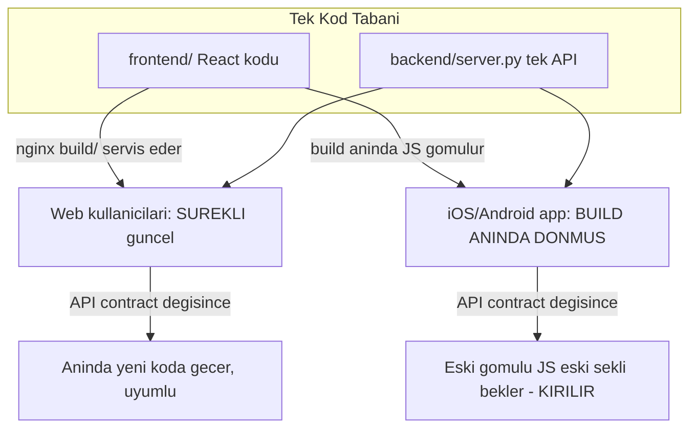

# PLANN — Mimari Sağlamlaştırma ve Performans Yol Haritası

> Bu belge, `/root/.cursor/plans/` altındaki plan dosyasının workspace root'una kopyasıdır.
> Amaç: bir daha "yeni backend eski app'i bozdu" krizini yaşamamak, performansı eski build'leri riske atmadan artırmak ve sistemi 100 müşteriden 10.000 müşteriye taşırken tekrar yazdırmayacak kalıcı mimariye oturtmak.

---

## 1. Temel Mimari İlke (her kararın turnusol testi)

Backend performans optimizasyonları serbesttir; **API sözleşmesi (contract) değildir.**

İki ayrımı asla karıştırma:

- **Veri / response ŞEKLİ (contract):** alan isimleri, array mı obje mi, sıralama mantığı. Bu bir sözleşmedir; değişirse donmuş eski build bozulur.
- **İçsel implementasyon:** cache, index, denormalizasyon, gzip, sorgu optimizasyonu. Çıkan byte'lar aynı kaldığı sürece istediğin gibi değiştirebilirsin.

İkinci bir ayrım (yaşadığımız kafa karışıklığının kaynağı):

- **Backend API + VERİ** -> tüm uygulamalara (iOS/Android/web) anında yansır.
- **Frontend JS render KODU** -> build anında uygulamaya gömülür (`capacitor.config.json`'da `server.url` YOK, `webDir: "build"`), eski build'de **donmuştur**, backend'den değiştirilemez. Backend ancak donmuş JS'in beklediği şekle **uyarak** etrafından dolaşabilir (bkz. `/customers` düzeltmesi).

---

## 2. Mevcut Mimari ve Kök Sorun: Web/Mobil Skew

Kök sebep: Web sürekli deploy (prod'da düzenle -> nginx anında servis), mobil ise build-anında-donmuş; ikisi **tek `frontend/` + tek backend** paylaşıyor. Bu yüzden her API contract değişikliği otomatik bir web/mobil skew üretir. `/customers` kazası bir tesadüf değil, bu mimarinin doğal sonucuydu.

---

## 3. Tespit Edilen Sorunlar

1. **Eski build kırılganlığı (skew):** Yukarıdaki mimari; her contract değişikliği eski App Store build'lerini riske atıyor.
2. **Legacy `/customers` dondurma zorunluluğu:** Performans için denormalize-only'ye çevrilince eski build bozuldu; `appointments + customers merge` (is_pending sadece randevusuz) haline geri döndürüldü. Bu path artık DONMUŞ kabul edilmeli. Konum: `backend/server.py` ~11230.
3. **Docker deploy tuzağı:** Backend kaynak kodu image'a `COPY` ediliyor, volume mount YOK (`docker-compose.yml` `backend` servisi sadece `backend_static` mount ediyor). `docker restart` eski kodu çalıştırır; `docker compose build backend && docker compose up -d backend` şart. Bu tuzak canlı bir olayda bir kez bizi yakaladı.
4. **Performans darboğazları (k6 T1-T3):** `/appointments` p95 ~4s, dashboard cache-miss 3-4s, legacy `/customers` payload (~1021 müşteri x ~150 byte = ~150 KB, 300 RPS'te ~45 MB/s). Detay: `Root Dosyaları/k6_analiz_raporu.md`.
5. **PostHog kaynak baskısı:** `free -h` -> 15 GB RAM'in 481 MB'ı boş, 19 GB swap'in 12 GB'ı dolu. Ana sebep production API ile aynı kutuda çalışan PostHog (ClickHouse/Kafka/Postgres/Redis). Analitik yükü latency-hassas API'yle yarışıyor.
6. **Force-update / min-sürüm mekanizması YOK:** Donmuş eski build'leri kontrol edemiyoruz; legacy contract'ı emekliye ayıramıyoruz.
7. **Android sürüm kopukluğu (SSOT yok):** git'teki `frontend/android/app/build.gradle` `versionCode 20 / versionName "2.0"`, son commit 1 Mart 2026. Gerçek sürüm sadece PC'de + Play Console'da bumplanıyor. iOS ise git'te güncel (`MARKETING_VERSION = 5.8`, build 58). Force-update politikası için Android'in "canlı sürümü" hiçbir tek kaynakta değil.
8. **OTA yok:** JS bundle gömülü; JS-only değişiklikler bile App Store review'a (~2 gün) ve manuel Android Studio/AAB dansına takılıyor.
9. **Operasyon sözleşmesi / contract test yok:** Deploy prosedürü, cache invalidation kuralları, sürüm politikası kimsenin kafasında; koddan hızlı unutuluyor.

---

## 4. Yol Haritası (sıralı, risk-etiketli)

### Faz 0 — Bugün: Güvenlik ağı (SIFIR risk, diğer her şeyin ön koşulu) — ✅ TAMAMLANDI

- **Golden snapshot al (ŞU AN, bilinen-iyi referans):** Eski build'in çağırdığı `GET /customers` (parametresiz) ve `GET /appointments` (parametresiz) response'larının örnek JSON'larını `backend/tests/contracts/` altına kaydet. Yarın refactor yapmadan önce "doğru" fotoğraf elde. Not: dinamik alanlar (tarih, `_id`) için birebir değer değil, **şema/alan-tipi** seviyesinde assert.
- **Contract test yaz:** Legacy endpoint response'unun anahtar seti + tipleri golden'a uymazsa CI'da patlasın (field silme / tip değişimi / array->obje dönüşümü yakalanır).
- **`OPERATIONS.md` iskeleti oluştur** (içerik için bkz. Bölüm 6).

### Faz 0.5 — Sözleşme güvenlik ağını GENELLEŞTİR — ✅ TAMAMLANDI

Faz 0 reaktifti (2 kırılan endpoint donduruldu). Gerçek koruma = korunan şeyin endpoint değil
**response modeli** olduğunu kavrayıp tüm modelleri kilitlemek. 3 katman + kalıcı AI kuralı:

- **RESPONSE şema snapshot (TÜM API otomatik):** `models_fieldset_v1.json` +
  `test_model_fieldset_contract.py`. Alan silme/rename patlatır; ekleme güvenli. 12 model kilitli.
- **REQUEST şema snapshot (TÜM body modelleri otomatik):** `request_required_v1.json` +
  `test_request_contract.py`. Bir alan zorunlu hale gelirse (eski client 400) patlar. 60 model kilitli.
  (Response değişmese bile request kırılması gerçek risk — ChatGPT'nin haklı eklemesi.)
- **Mobil API Surface envanteri:** `mobile_api_surface.md` (169 endpoint, `frontend/src`'ten oto;
  `gen_mobile_surface.sh` ile yenilenir).
- **Contract version işaretleri:** donmuş endpoint dekoratörleri üstünde `# ═══ CONTRACT: v1 (FROZEN...) ═══`
  marker'ı (gelecekteki refactor'u caydırır; tarihsel sebebi kodda gösterir).
- **Kalıcı AI kuralı:** `.cursor/rules/api-contract.mdc` (`alwaysApply: true`) — her AI oturumunda
  otomatik okunur; endpoint/model'e dokunmadan önce surface + golden kontrolü + additive-only + test.
- Sınır: şema testleri davranış (anlam/birim) değişimini yakalamaz → kritikler için golden JSON kalır.

### Faz 1 — Sıfır risk performans (eski build'e tamamen şeffaf) — ✅ TAMAMLANDI

- **Nginx gzip aç:** `gzip on; gzip_comp_level 5; gzip_min_length 1024; gzip_vary on; gzip_types application/json ...`. ~150 KB legacy customers response'unu ~15-30 KB'a indirir. HTTP istemcileri (WKWebView/axios) otomatik açar; byte-identik. Doğrulama: `curl -I -H "Accept-Encoding: gzip" https://plannapp.co/api/customers` -> `Content-Encoding: gzip` görülmeli. Konum: `system_configs/` nginx conf.
- **Mongo index ekle:** `appointments` için `(organization_id, status, appointment_date)` compound index (dashboard aggregate'lerinin çoğu bu alanları filtreliyor). Konum: `backend/server.py` lifespan index bloğu.
- **Dashboard aggregate optimizasyonu:** cache-miss senaryosu 3-4s. Pipeline'ı incele; gerekirse bazı sayaçları (customers gibi) denormalize et veya `$facet` yerine `asyncio.gather`. Response şekli değişmez, parametre yok -> eski build etkilenmez.

### Faz 2 — Parametre-versiyonlu (legacy şekle DOKUNMA) — ✅ TAMAMLANDI (backend; frontend geçişi bilinçli ertelendi)

- **`/appointments` cursor pagination:** `/customers`'ta kanıtlanmış deseni uygula: parametresiz / eski parametrelerle (`date`, `start_date`, `status`...) -> **eskisi gibi tam array** (eski build bunu kullanır); yeni `?limit=&cursor=` gönderilince -> yeni paginated şekil. Konum: `backend/server.py` ~7512 (`response_model=List[Appointment]`). Web tarafı yeni parametreye geçer.

### Faz 3 — Force-update (legacy borcunun KAPATMA VANASI) — ✅ TAMAMLANDI (etki için yeni native build gerekir — "sıfırıncı build")

Stratejik çerçeve: Force-update "geleceği koruma" değil, **legacy contract'ı bir gün silebilmeni sağlayan mekanizma**. Ama mevcut sahadaki build'de version-check kodu YOK -> bu "sıfırıncı build"tir; sadece bundan sonraki build'leri kontrol eder. Legacy freeze, mevcut popülasyon güncelleyene kadar kalır.

- **Backend:** `min_supported_version` ve `latest_version`'ı **DB'den (settings)** oku, deploy'suz bumplanabilsin. **Platform bazlı olmalı:** `{ "ios": "x.y.z", "android": "x.y.z" }` (iOS/Android ayrı bumplanıyor). Login response'una veya hafif `/api/app/config`'e göm. Backend sadece SİNYAL versin; **isteği hard-reject ETME** (yoksa korumaya çalıştığımız eski build'i kırarız).
- **Frontend (saf JS, yeni native plugin YOK — `@capacitor/app` zaten kurulu):** Açılışta ve mevcut `appStateChange` listener'ında (`frontend/src/App.js` ~914) `CapacitorApp.getInfo()` ile sürümü oku, semver karşılaştır. İki katman: `min_supported` altı -> **kapatılamayan tam ekran modal** + platforma göre store linki; `latest` altı -> kapatılabilir yumuşak uyarı. **Fail-open:** version-check isteği başarısızsa kullanıcıyı ASLA kilitleme.
- **Avantaj:** Tamamen JS olduğu için mevcut pipeline'dan (Codemagic / Android) sıfır sürtünmeyle geçer, bir sonraki normal build'e sığar.

### Faz 4 — Altyapı (senin yöneteceğin, paralel yürür) — ✅ TAMAMLANDI (PostHog ayrıştırma + Android SSOT; Codemagic Android workflow opsiyonel, bekliyor)

- **PostHog'u ayrı sunucuya taşı:** ~14 EUR Hetzner (8 GB RAM, CX32/CPX31). Ana sunucudaki 12 GB swap baskısını kaldırır; API p95/cache/Mongo I/O kaynağa dokunmadan rahatlar. Capgo'dan bağımsız, tek başına haklı hamle. UYARI: bu kutuya full-Capgo (Supabase) KURMA -> aynı RAM problemini oraya taşırsın.
- **Android sürümünü tek kaynağa (git) çek:**
  1. Acil: PC'deki / Play Console'daki gerçek `versionCode`/`versionName`'i öğren, git'teki `frontend/android/app/build.gradle`'a yaz + commit (Mart'tan kalma 2.0/20 yanlışlığını bitir).
  2. Kural: Android sürüm bump'ı bundan sonra **git'te** yapılır; PC yalnızca temiz `git pull`'dan build alır.
  3. İdeal: Android'i de **Codemagic Android workflow**'una taşı (AAB + Play Store publish). Manuel PC adımı ve divergence riski kökten biter; her iki platform git'ten build alınır.

### Faz 5 — OTA (EN SON, bilinçli) — ⬜ BEKLİYOR (ota-decision; ön koşullar force-update + PostHog ayrıştırması bitti, karar verilebilir)

Senin için ortalamadan daha değerli: manuel Android akışını (JS-only'de) ortadan kaldırır, tek bundle iki platforma gider, Codemagic upload'ı otomatikleştirebilir. Ama native plugin ekler -> "sıfırıncı build" kuralı geçerli; ve rollback/imzalama riskini getirir.

- İnce self-host (FastAPI karar-endpoint + Cloudflare R2 storage, ~0 RAM, ~0 USD) **vs** Capgo Cloud (~14 USD, imzalama+rollback+Apple-uyum yönetilmiş). Karar Bölüm 5'te.
- Hangi yol olursa olsun: **rollback güvenliği şart** (bozuk bundle -> `appReadyTimeout` + son sağlam sürüme fallback), v6+ imzalama (private/public key + sha256), Apple 3.3.2 uyumu.

---

## 5. Açık Kararlar (uygulamadan önce netleştirilecek)

- **OTA modeli:** Capgo Cloud (14 USD, sıfır ops) mı, ince self-host (0 USD, imzalama+rollback+Apple riski sende) mi? Öneri: force-update + PostHog ayrıştırması bitene kadar ertele; sonra ops bandwidth'ine göre karar ver.
- **Legacy `/customers` Redis cache:** Şart mı? Legacy artık appointments+merge (pahalı) yaptığı için cache mantıklı; AMA invalidation eksiksiz olmalı. Alternatif: önce sadece gzip'i ölç -> tek-istek maliyeti kabul edilebilirse cache'in invalidation riskine hiç girme.
- **Android CI:** Manuel PC + git-disiplini ile devam mı, yoksa Codemagic Android workflow'a taşıyıp tam otomasyon mu?

---

## 6. Operasyon Sözleşmesi (`OPERATIONS.md` içeriği)

Koddan hızlı unutulan bu bilgiyi versiyonlanan bir belgeye sabitle:

- **Deploy prosedürü:** Backend değişiminde `docker compose build backend && docker compose up -d backend` ZORUNLU; `docker restart` YASAK (kod image'a COPY ediliyor, volume mount yok).
- **Legacy contract listesi:** `/customers` ve `/appointments` (parametresiz) DONDURULDU — şeklini değiştirme, App Store build'leri buna bağlı. Koda da `# LEGACY CONTRACT — do not change response shape` yorumu ekle.
- **Cache invalidation matrisi:** hangi event hangi key'i siler (dashboard_stats, customers_list, gelecekte legacy customers cache). Eksik invalidation = performans değil, VERİ TUTARLILIĞI hatası.
- **Sürüm politikası:** `min_supported_version` DB'de, platform bazlı; fail-open kuralı; her mobil release'de sürüm bump zorunlu (iOS `project.pbxproj`: `MARKETING_VERSION` + `CURRENT_PROJECT_VERSION`; Android `build.gradle`: `versionName` + `versionCode`). Android bump git'te yapılır.
- **iOS release iki adımlı:** Codemagic -> TestFlight -> App Store'a manuel terfi (`codemagic.yaml` `submit_to_app_store: false`). Sıfırıncı build + 2 gün review + adoption süresini hesaba kat.
- **Rollback prosedürü:** (OTA gelince) bozuk bundle'da ne yapılır.

---

## 7. Önerilen Uygulama Sırası (özet)

1. Faz 0 (bugün): golden snapshot + contract test + `OPERATIONS.md` iskeleti.
2. Faz 1: nginx gzip + Mongo index + dashboard aggregate.
3. Faz 3: force-update (JS-only, mevcut pipeline'dan geçer) -> sıfırıncı build -> TestFlight/App Store + Play Store.
4. Faz 4 (paralel): PostHog ayrıştırma + Android SSOT/Codemagic.
5. Faz 2: `/appointments` pagination (yeni parametre arkasında).
6. Faz 5: OTA (en son, karar sonrası).

En yüksek kalıcı getiri: **PostHog ayrıştırması + force-update (sürüm yönetimi).** Bunlar "tekrar yazdırmayan" yatırımlar; legacy hız yamaları ise zaten geçici geçiş mekanizmaları.

---

## 8. Yapılacaklar (Checklist)

- [x] **golden-snapshot:** `backend/tests/contracts/` altına legacy `GET /customers` ve `GET /appointments` (parametresiz) response'larının golden snapshot'ını al (bilinen-iyi referans); şema/tip seviyesinde contract test yaz. -> `backend/tests/contracts/*.json` + `backend/tests/integration/test_legacy_contracts.py` (2 test geçti).
- [x] **operations-md:** `OPERATIONS.md` oluştur: deploy prosedürü (build+up, restart yasak), legacy contract listesi, cache invalidation matrisi, sürüm politikası, iOS/Android release adımları. -> `OPERATIONS.md` (root).
- [x] **nginx-gzip:** `/etc/nginx/nginx.conf` http bloğunda `gzip_proxied any` + `gzip_types application/json` + `gzip_comp_level 5` + `gzip_min_length 1024` aktif edildi. Doğrulama: `/api/appointments` **261 KB → 26 KB (~%90)**, `content-encoding: gzip` + `vary: Accept-Encoding`. (Not: değişiklik global nginx.conf'ta, git dışı; yedek `/etc/nginx/nginx.conf.bak.*`.)
- [x] **mongo-index:** `appointments`'a `(organization_id, status, appointment_date)` compound index eklendi (server.py lifespan ~1014); deploy sonrası Mongo'da doğrulandı.
- [x] **dashboard-aggregate:** `_compute_dashboard_stats` paralelleştirildi (`asyncio.gather`) + `find+python sum` yerine sunucu-taraflı `$group` aggregation. Gerçek DB'de eski==yeni denkliği doğrulandı (20 org). Response şekli değişmedi.
- [x] **force-update-backend:** `GET /api/app/config` (public, auth'suz) + `PUT /api/superadmin/app-config` (superadmin) eklendi. `min_supported_version`/`latest_version`/`store_urls` DB'de (`app_config` collection, `_id="global"`), platform bazlı (`{ios, android}`), deploy'suz bumplanır. Config yoksa fail-open default (`min=0.0.0`). Sadece sinyal; hard-reject yok.
- [x] **force-update-frontend:** `versionCheck.js` (semver parse/compare/evaluate) + `ForceUpdateModal.js` (iki katman: kapatılamayan tam-ekran / kapatılabilir banner) + `App.js`'e entegre (`CapacitorApp.getInfo()` açılışta + `appStateChange`, sadece native, fail-open). i18n (tr/en) eklendi. **Süper Admin → Sürüm Yönetimi** (`SAAppVersion.js`) paneliyle görsel yönetim + her release'de yapılacaklar kontrol listesi.
- [x] **posthog-split:** PostHog ayrı sunucuya TAŞINDI; bu sunucudaki tüm PostHog docker servisleri (container/volume/network/image) + nginx `posthog` conf + `/root/posthog-analiz` compose klasörü SİLİNDİ. Kazanım: ~34GB disk boşaldı, swap kullanımı 6.6GB→1.7GB düştü, RAM available 8.4GB'a çıktı; ana sunucudaki analitik kaynak baskısı tamamen kalktı. Yeni proje token'ı frontend `.env.production` + backend `.env`'e yazıldı (`phc_Bp7...`). Ana sunucuda kalan tek entegrasyon: `posthog-js` (session replay + funnel event + ekran/screen takibi) uzaktaki PostHog'a gönderim. (full-Capgo yeni kutuya KURULMADI — kural korundu.)
- [x] **android-ssot:** PC'deki canlı Android projesi git'e senkronlandı (Ağu 2026). git artık gerçekle uyumlu: canlı Play Store `3.1/31` → git bir sonraki release için `versionCode 32 / versionName "3.2"`. Sürüm dışında yakalanan drift'ler de git'e alındı: `variables.gradle` compile/target SDK `35→36`, `build.gradle` AGP `8.2.1→8.13.2`, gradle wrapper `8.2.1→8.13`, `AndroidManifest.xml` izinleri (READ/WRITE_CONTACTS, VIBRATE, RECORD_AUDIO), capacitor plugin include'ları (contacts, speech-recognition, text-to-speech, haptics, status-bar). PC dosyaları CRLF olduğu için sadece 8 gerçek içerik farkı LF ile alındı (satır-sonu gürültüsü elendi). 751MB'lık transfer klasörü `.gitignore`'a eklendi. Kural: bump bundan sonra **git'te** yapılır, PC yalnız `git pull` + AAB. **Codemagic Android workflow TAMAMLANDI (Ağu 2026):** `android-capacitor-workflow` (`mac_mini_m2`) AAB build alıyor; kritik: Capacitor 7 `@capacitor/android` v7 modülü Java 21 zorunlu → adımda `/usr/libexec/java_home -v 21` + gradlew'e `-Dorg.gradle.java.home` inline dayatıldı (PC'de Android Studio JBR 21 kullandığı için görünmüyordu). Keystore Codemagic env'de base64, `app/build.gradle`'da koşullu signingConfig. Otomatik trigger YOK (manuel başlat).
- [ ] **android-play-publish:** Codemagic Android publishing'i `email`'den DOĞRUDAN `google_play` (credentials + track) publish'e çevir; Google Play service account JSON'u Codemagic env'e ekle. Bitince manuel Play yükleme adımı kalkar.
- [x] **appointments-pagination (Faz 2):** `/appointments`'a parametre-versiyonlu cursor pagination eklendi (server.py ~7570). limit YOK → legacy tam array (donmuş build); `?limit=&cursor=` → `{items, next_cursor, has_more}` (JSONResponse ile response_model baypas, item şekli birebir `Appointment`). Cursor: base64(`appointment_date|appointment_time|id`), sıra artan. Doğrulandı: legacy 87 kayıt/23 alan, paginated item 23 alan (missing/extra=0), cursor çakışmasız; 4 contract test geçti. **Frontend geçişi bilinçli olarak YAPILMADI:** `Calendar.js` zaten tarih-aralığı filtreli (payload sınırlı), `App.js` global `appointments` store'u tam-array ister (infinite-scroll değil) → mevcut tüketiciler legacy array'de kalır; backend yeteneği ileride ayrı "tüm randevular" ekranı için hazır.
- [ ] **ota-decision:** OTA kararı: Capgo Cloud vs ince self-host (R2); rollback+imzalama+Apple uyumu ile en son faz olarak değerlendir.
